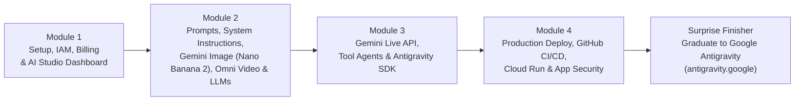

# Google AI Studio: Zero to Hero Course (EN / ES)

> **From your very first prompt in Google AI Studio to shipping secure, real-time multimodal AI agents on Google Cloud Run — and graduating into autonomous software engineering with [Google Antigravity](https://antigravity.google).**

[](./en/README.md)
[](./es/README.md)
[](https://allinvaders.github.io/aistudio-full-course/)
[](https://github.com/googleapis/python-genai)
[](./LICENSE)

---

## Choose Your Language / Elige tu Idioma

| Language / Idioma | Track Overview | Direct Links |
| :--- | :--- | :--- |
| **English Edition** | Full 4-module hands-on engineering course + Surprise Finisher ("Graduate to Antigravity") + Public References | [**Start English Track →**](./en/README.md) |
| **Edición en Español** | Curso práctico completo de 4 módulos + Cierre Sorpresa ("Graduación hacia Antigravity") + Referencias Públicas | [**Iniciar Curso en Español →**](./es/README.md) |
| **Interactive Web Portal** | Bilingual browser-based learning app (`EN` / `ES` live toggle, progress tracker, quizzes, architecture diagrams) | [**Open Web Portal (`docs/`) →**](./docs/index.html) |

---

## Course Architecture & Progression ("Zero to Hero")



Throughout the course, every concept builds progressively toward a single flagship production application: **AI Product Studio & Live Multimodal Copilot** — an end-to-end AI application that evolves from a structured prompt & media generator into a real-time bidirectional voice/video agent deployed securely on Google Cloud Run, and finally graduates into a self-improving autonomous multi-agent engineering workspace inside **Google Antigravity**.

---

## Curriculum Overview (English & Español)

| # | Module Title (English / Español) | Core Topics Covered | Runnable Labs & Notebooks |
| :-: | :--- | :--- | :--- |
| **01** | [**Setup, IAM Permissions, Billing, Users & Dashboard**](./en/module-01-setup-iam-billing/README.md)<br/>[**Configuración, Permisos IAM, Facturación, Usuarios y Panel**](./es/module-01-setup-iam-billing/README.md) | Google AI Studio vs. Vertex AI, API Keys vs. ADC, Free vs. Paid tiers, RPM/TPM/RPD quotas & data privacy guarantees, least-privilege IAM roles (`roles/aiplatform.user`, `roles/secretmanager.secretAccessor`, `roles/run.invoker`), team management, budget alerts & dashboard telemetry. | [`labs/module-01-setup-verify/`](./labs/module-01-setup-verify/)<br/>[`notebooks/01_Setup_Models_and_Token_Economics.ipynb`](./notebooks/01_Setup_Models_and_Token_Economics.ipynb) |
| **02** | [**Basics, Prompts, System Instructions, Media Generation & LLMs**](./en/module-02-basics-prompts-media-llms/README.md)<br/>[**Fundamentos, Prompts, Instrucciones del Sistema, Multimedia y LLMs**](./es/module-02-basics-prompts-media-llms/README.md) | Model selection (`gemini-3.7-flash` vs. `gemini-3.1-pro`), Thinking Budgets (`thinking_config`), System Instructions, deterministic JSON outputs (Pydantic / JSON Schema), image generation with **Gemini 3.1 Flash Image (`gemini-3.1-flash-image` / Nano Banana 2)**, video generation with **Gemini Omni 1.1 Flash (`gemini-omni-1.1-flash`)**, and **Stage 1 of the Flagship Project**. | [`labs/module-02-prompts-media/`](./labs/module-02-prompts-media/)<br/>[`notebooks/02_Prompts_Structured_Outputs_Gemini_Image_and_Omni_Video.ipynb`](./notebooks/02_Prompts_Structured_Outputs_Gemini_Image_and_Omni_Video.ipynb) |
| **03** | [**Live Models, Agents, Antigravity SDK & Apps**](./en/module-03-live-agents-antigravity-sdk/README.md)<br/>[**Modelos en Vivo (Live API), Agentes, Antigravity SDK y Apps**](./es/module-03-live-agents-antigravity-sdk/README.md) | Real-time low-latency audio/video streaming with **Gemini Live API** (`client.aio.live.connect`), Voice Activity Detection (VAD) & barge-in interruption handling, tool calling & agent loops, deep dive into the **Google Antigravity SDK** harness, and **Stage 2 of the Flagship Project**. | [`labs/module-03-live-agents/`](./labs/module-03-live-agents/)<br/>[`notebooks/03_Gemini_Live_API_Tool_Agents_and_Antigravity_SDK.ipynb`](./notebooks/03_Gemini_Live_API_Tool_Agents_and_Antigravity_SDK.ipynb) |
| **04** | [**Deploy to Production, GitHub CI/CD, Cloud Run, Security & Milestone Project**](./en/module-04-deploy-github-cloudrun-security/README.md)<br/>[**Despliegue a Producción, GitHub CI/CD, Cloud Run, Seguridad y Proyecto Hito**](./es/module-04-deploy-github-cloudrun-security/README.md) | Dockerizing FastAPI + WebSockets, keyless GitHub Actions CI/CD with Workload Identity Federation (`google-github-actions/auth@v2` + `deploy-cloudrun@v2`), Secret Manager, prompt injection defense, rate limiting, CORS & IAM auth, and shipping **Stage 3: Full Milestone Project**. | [`milestone-project/`](./milestone-project/)<br/>[`.github/workflows/deploy-cloudrun.yml`](./.github/workflows/deploy-cloudrun.yml) |
| **🎓** | [**Surprise Finisher: Graduate to Google Antigravity**](./en/surprise-finisher-graduate-to-antigravity/README.md)<br/>[**Cierre Sorpresa: Graduación hacia Google Antigravity**](./es/surprise-finisher-graduate-to-antigravity/README.md) | Crossing the bridge from calling LLM APIs to orchestrating autonomous software engineering agents inside [**Google Antigravity**](https://antigravity.google): `.agents/rules/`, custom reusable Skills (`SKILL.md`), Model Context Protocol (MCP) servers, parallel subagents, and self-improving codebases. | [`milestone-project/.agents/`](./milestone-project/.agents/)<br/>[`notebooks/04_Security_Evals_and_Graduation_to_Antigravity.ipynb`](./notebooks/04_Security_Evals_and_Graduation_to_Antigravity.ipynb) |

---

## Interactive Google Colab Notebooks

| Notebook | Description | Launch in Colab |
| :--- | :--- | :--- |
| **01. Setup, Models & Token Economics** | Verify API keys, inspect model capabilities, count tokens, and calculate unit economics across Gemini models. | [](https://colab.research.google.com/github/AllInVaders/aistudio-full-course/blob/main/notebooks/01_Setup_Models_and_Token_Economics.ipynb) |
| **02. Prompts, Structured Outputs, Gemini 3.1 Flash Image (Nano Banana 2) & Gemini Omni 1.1 Flash** | Build Stage 1 of the AI Product Studio with System Instructions, Thinking Budgets, Pydantic schemas, Gemini 3.1 Flash Image (Nano Banana 2) & Gemini Omni 1.1 Flash. | [](https://colab.research.google.com/github/AllInVaders/aistudio-full-course/blob/main/notebooks/02_Prompts_Structured_Outputs_Gemini_Image_and_Omni_Video.ipynb) |
| **03. Gemini Live API, Tool Agents & Antigravity SDK** | Stream bidirectional multimodal sessions, execute tools automatically, and orchestrate agents with the Antigravity SDK. | [](https://colab.research.google.com/github/AllInVaders/aistudio-full-course/blob/main/notebooks/03_Gemini_Live_API_Tool_Agents_and_Antigravity_SDK.ipynb) |
| **04. Security Guardrails, Evals & Antigravity Graduation** | Red-team prompt injection defenses, run LLM-as-a-Judge evaluations, and graduate your app into Google Antigravity. | [](https://colab.research.google.com/github/AllInVaders/aistudio-full-course/blob/main/notebooks/04_Security_Evals_and_Graduation_to_Antigravity.ipynb) |

---

## Repository Directory Layout

```text
aistudio-full-course/
├── README.md                          # Bilingual Master Course Hub (EN / ES)
├── LICENSE                            # MIT Open Source License
├── .env.example                       # Environment template (safe public defaults)
├── .github/workflows/
│   ├── deploy-cloudrun.yml            # Keyless GitHub Actions -> Google Cloud Run CI/CD
│   └── deploy-pages.yml               # Automated GitHub Pages course portal publisher
├── docs/                              # Interactive Zero-Build Web Portal (EN/ES live toggle)
│   ├── index.html
│   ├── styles.css
│   ├── course-data.js
│   └── app.js
├── en/                                # Complete English Curriculum (Modules 1-4 + Finisher + Refs)
├── es/                                # Complete Spanish Curriculum (Módulos 1-4 + Cierre + Refs)
├── labs/                              # Runnable Python & Node.js/ESM Code Labs per Module
├── milestone-project/                 # Production FastAPI + WebSocket + Cloud Run Capstone App
│   ├── app/                           # Backend API + Gemini Live WebSocket Bridge + Web UI
│   ├── .agents/                       # Antigravity Graduation Rules & Skills
│   ├── Dockerfile                     # Production non-root container image
│   └── deploy-cloudrun.sh             # 1-command Cloud Run deployment script
└── notebooks/                         # 4 Interactive Jupyter / Google Colab Notebooks
```

---

## 5-Minute Quick Start

### 1. Clone the repository & configure your API Key

```bash
git clone https://github.com/AllInVaders/aistudio-full-course.git
cd aistudio-full-course
cp .env.example .env
# Edit .env and paste your GEMINI_API_KEY from https://aistudio.google.com/apikey
```

### 2. Install Python & Node.js dependencies

```bash
# Python environment
python3 -m venv .venv
source .venv/bin/activate
pip install --upgrade google-genai fastapi "uvicorn[standard]" pydantic websockets

# Run Module 1 setup verification
python3 labs/module-01-setup-verify/verify_setup.py
```

### 3. Launch the Interactive Course Web Portal locally

```bash
python3 -m http.server 8000 --directory docs
# Open http://localhost:8000 in your browser (instant EN / ES toggle!)
```

### 4. Run the Full-Stack Milestone Project locally

```bash
cd milestone-project
pip install -r requirements.txt
uvicorn app.main:app --reload --port 8080
# Open http://localhost:8080
```

---

## Verified Public References & Official Documentation

Every module in this course relies strictly on verified, publicly available documentation and open-source SDKs:

- **Google AI Studio Portal**: [https://aistudio.google.com](https://aistudio.google.com)
- **Google AI for Developers Documentation**: [https://ai.google.dev/gemini-api/docs](https://ai.google.dev/gemini-api/docs)
- **Unified Google Gen AI Python SDK (`google-genai`)**: [https://github.com/googleapis/python-genai](https://github.com/googleapis/python-genai) & [API Reference](https://googleapis.github.io/python-genai/)
- **Unified Google Gen AI JS/TS SDK (`@google/genai`)**: [https://github.com/googleapis/js-genai](https://github.com/googleapis/js-genai)
- **Gemini Live API (Real-time Bidirectional Multimodal Streaming)**: [https://ai.google.dev/gemini-api/docs/live-api](https://ai.google.dev/gemini-api/docs/live-api)
- **Gemini 3.1 Flash Image (`gemini-3.1-flash-image` / Nano Banana 2) Image Generation Guide**: [https://ai.google.dev/gemini-api/docs/image-generation](https://ai.google.dev/gemini-api/docs/image-generation)
- **Gemini Omni 1.1 Flash Video Generation Guide**: [https://ai.google.dev/gemini-api/docs/video](https://ai.google.dev/gemini-api/docs/video)
- **Google AI Studio Billing, Pricing & Rate Limits**: [https://ai.google.dev/gemini-api/docs/billing](https://ai.google.dev/gemini-api/docs/billing) & [https://ai.google.dev/pricing](https://ai.google.dev/pricing)
- **Google Antigravity Platform & SDK**: [https://antigravity.google](https://antigravity.google)
- **Google Cloud Run Documentation**: [https://cloud.google.com/run/docs](https://cloud.google.com/run/docs)
- **GitHub Actions for Google Cloud (`auth` & `deploy-cloudrun`)**: [https://github.com/google-github-actions/deploy-cloudrun](https://github.com/google-github-actions/deploy-cloudrun)
- **Full Master Bibliographies**: [English References (`en/REFERENCES.md`)](./en/REFERENCES.md) | [Referencias en Español (`es/REFERENCES.md`)](./es/REFERENCES.md)
