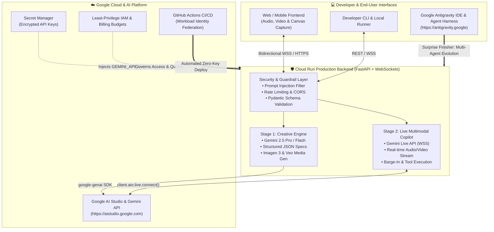
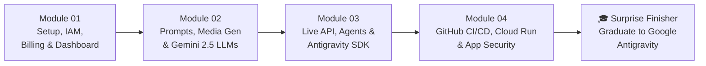

# 🚀 Google AI Studio & Gemini Full Course: Zero to Hero (English Edition)

Welcome to the **Google AI Studio, Gemini 2.5, Live API, Cloud Run & Google Antigravity** complete developer curriculum!

This open-source, hands-on engineering course takes you from your very first API call in **Google AI Studio** all the way to architecting, securing, deploying, and autonomously evolving a production-grade **AI Product Studio & Live Multimodal Copilot** on **Google Cloud Run** and **Google Antigravity** (`https://antigravity.google`).

> **Language / Idioma:** **English** | [Español (`../es/README.md`)](../es/README.md) | [Repository Root (`../README.md`)](../README.md)

---

## 🎯 What You Will Build: The Flagship Milestone Project

Rather than disconnected toy scripts, every module in this course builds a concrete layer of a single cohesive, production-ready application: **AI Product Studio & Live Multimodal Copilot**.



### How the Flagship Project Evolves Across Modules
1. **Module 1 (Foundation & Governance):** Configure your Google AI Studio workspace, API key security, Google Cloud project, least-privilege IAM roles, billing budget alerts, and automated environment health verifier.
2. **Module 2 (Stage 1 — Creative Engine):** Build the multimodal product design engine using **Gemini 2.5 Pro & Flash**, `thinking_config` reasoning budgets, **System Instructions**, strict **Pydantic Structured Outputs**, **Imagen 3** (`generate_images`), and **Veo** (`generate_videos`).
3. **Module 3 (Stage 2 — Live Multimodal Copilot & Agents):** Upgrade the studio with real-time bidirectional voice/video streaming via the **Gemini Live API** (`client.aio.live.connect`), Voice Activity Detection (VAD) barge-in handling, autonomous function-calling tool loops, and the **Google Antigravity SDK**.
4. **Module 4 (Stage 3 — Production Deployment & Security):** Containerize the FastAPI + WebSocket server with Docker, wire zero-secret CI/CD via **GitHub Actions + Workload Identity Federation**, mount secrets from **Secret Manager**, enforce defense-in-depth application security, and deploy live to **Google Cloud Run**.
5. **Surprise Finisher (Graduation to Google Antigravity):** Graduate from writing individual API calls to orchestrating autonomous multi-agent software engineering inside **Google Antigravity** (`https://antigravity.google`) using `.agents/rules/`, reusable `SKILL.md` skills, MCP servers, and parallel subagents.

---

## 🗺️ Complete Curriculum Roadmap



| Module | Title & Core Topics | Hands-On Deliverable |
| :--- | :--- | :--- |
| **[Module 01](./module-01-setup-iam-billing/README.md)** | **Setup & Intro, IAM Permissions, Billing, Users & Dashboard**<br>• AI Studio vs. Vertex AI decision matrix<br>• API Keys vs. ADC & Service Accounts<br>• Free vs. Paid Tier quotas & data privacy guarantees<br>• Least-privilege IAM (`roles/aiplatform.user`, `roles/secretmanager.secretAccessor`, `roles/run.invoker`)<br>• Team governance, budget alerts & full AI Studio Dashboard tour | **Lab 01:** Automated Setup, IAM & Model Catalog Verifier (Python + TypeScript) |
| **[Module 02](./module-02-basics-prompts-media-llms/README.md)** | **Basics, Prompts, System Instructions, Media Generation & LLMs**<br>• Gemini 2.5 Flash vs. Gemini 2.5 Pro & token economics<br>• Controlling reasoning depth with `thinking_config`<br>• System Instructions, persona anchoring & few-shot prompting<br>• Guaranteed JSON with Pydantic & TypeScript schemas<br>• Image generation with **Imagen 3** & video generation with **Veo** | **Stage 1 Flagship Build:** AI Product Studio Creative Engine (Specs + Hero Images + Video Reels) |
| **[Module 03](./module-03-live-agents-antigravity-sdk/README.md)** | **Live Models, Agents, Antigravity SDK & Apps**<br>• Gemini Live API (`client.aio.live.connect`) over WebSockets<br>• Real-time PCM audio, video frames, VAD & barge-in handling<br>• Tool use / function calling inside live & async agent loops<br>• Deep dive into the public **Google Antigravity SDK** & `antigravity.google` harness | **Stage 2 Flagship Build:** Live Multimodal Copilot + Autonomous Tool-Calling Agent |
| **[Module 04](./module-04-deploy-github-cloudrun-security/README.md)** | **Production Deployment, GitHub Integration, Cloud Run, App Security & Milestone Project**<br>• Production Dockerfile & FastAPI WebSocket server<br>• GitHub Actions CI/CD with Workload Identity Federation (`google-github-actions/auth@v2` & `deploy-cloudrun@v2`)<br>• App Security: Prompt injection defense, Gemini safety settings, rate limiting, CORS & IAM authentication | **Stage 3 Flagship Build:** Full Production Deployment of the Milestone Project to Cloud Run |
| **[Surprise Finisher](./surprise-finisher-graduate-to-antigravity/README.md)** | **🎓 I Want to Graduate to Use Antigravity (`antigravity.google`)**<br>• The shift from prompt engineering to agentic software engineering<br>• Connecting AI Studio API keys to **Google Antigravity**<br>• Authoring workspace rules (`.agents/rules/`), custom skills (`SKILL.md`), and MCP integrations<br>• Dispatching parallel subagents with the Antigravity SDK | **Graduation Capstone:** Transforming your Milestone Project into an autonomous, self-evolving codebase |
| **[Master References](./REFERENCES.md)** | **Verified Public References & Official Documentation Directory**<br>• Complete categorized directory of official docs, SDK repositories, Cloud guides, and security standards | Bookmarkable engineering reference index |

---

## 🛠️ Prerequisites & Local Development Setup

Everything in this course uses the **official unified Google Gen AI SDK** (`google-genai` for Python and `@google/genai` for TypeScript/JavaScript).

> [!WARNING]
> **Never use the legacy `google-generativeai` package!**
> The older `google-generativeai` package is deprecated and does not support Gemini 2.5 thinking budgets, the Live API, Veo video generation, or the unified client architecture. Always install `google-genai` (`from google import genai`).

### 1. Required Tools
- **Google Account** with access to [Google AI Studio](https://aistudio.google.com) (Free Tier works immediately for Modules 1–3!).
- **Google Cloud Project** with Billing enabled (required for Imagen 3/Veo paid quotas and Module 4 Cloud Run deployment).
- **Python 3.10+** (Python 3.11 or 3.12 recommended).
- **Node.js 20+ & npm** (for TypeScript/JavaScript examples).
- **Google Cloud CLI (`gcloud`)** ([Install Guide](https://cloud.google.com/sdk/docs/install)).
- **Docker Desktop or Docker Engine** (for Module 4 containerization).
- **Git & GitHub Account** (for Module 4 GitHub Actions CI/CD).

### 2. Clone & Configure Your Environment (60 Seconds)

```bash
# 1. Clone the public course repository
git clone https://github.com/AllInVaders/aistudio-full-course.git
cd aistudio-full-course

# 2. Create and activate a Python virtual environment
python3 -m venv .venv
source .venv/bin/activate  # On Windows: .venv\Scripts\activate

# 3. Install the official Google Gen AI SDK and course dependencies
pip install --upgrade google-genai pydantic fastapi uvicorn websockets pillow python-dotenv

# 4. (Optional) Install the official TypeScript/JS SDK
npm install @google/genai dotenv

# 5. Export your Google AI Studio API Key
export GEMINI_API_KEY="your-api-key-from-aistudio"
```

---

## 📖 How to Use This Repository

1. **Read sequentially or jump by role:**
   - **Application Developers:** Follow Modules 01 → 02 → 03 → 04 → Surprise Finisher in order.
   - **Cloud / DevSecOps Engineers:** Focus on **Module 01** (IAM, Billing, Quotas, Privacy) and **Module 04** (Workload Identity Federation, Cloud Run, Secret Manager, App Security).
   - **AI Agent Builders & Power Users:** Dive straight into **Module 03** (Gemini Live API & Tool Loops) and the **Surprise Finisher** (**Google Antigravity** multi-agent workflows).
2. **Run every code snippet:** Every module contains complete, copy-pasteable Python (`google-genai`) and TypeScript (`@google/genai`) implementations.
3. **Test your mastery:** Complete the self-assessment quiz at the bottom of each module before moving on.

---

## 🔗 Verified Public References & Official Documentation

- **Google AI Studio Workspace:** [https://aistudio.google.com](https://aistudio.google.com)
- **Gemini API Official Documentation:** [https://ai.google.dev/gemini-api/docs](https://ai.google.dev/gemini-api/docs)
- **Official Python SDK (`google-genai`):** [https://github.com/googleapis/python-genai](https://github.com/googleapis/python-genai)
- **Official TypeScript/JS SDK (`@google/genai`):** [https://github.com/googleapis/js-genai](https://github.com/googleapis/js-genai)
- **Google Antigravity Agentic Development Platform:** [https://antigravity.google](https://antigravity.google)
- **Google Antigravity Documentation:** [https://antigravity.google/docs](https://antigravity.google/docs)
- **Google Cloud Run Documentation:** [https://cloud.google.com/run/docs](https://cloud.google.com/run/docs)

---

👉 **Ready to begin? Head straight to [Module 01: Setup & Intro, IAM Permissions, Billing, Users & Dashboard](./module-01-setup-iam-billing/README.md)!**
