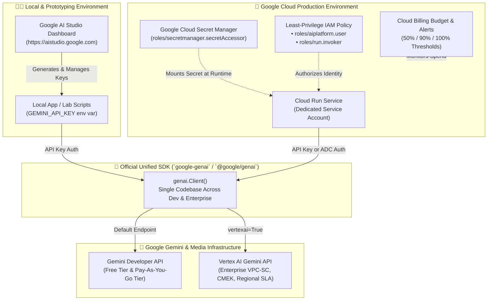

# Module 01: Setup & Intro, IAM Permissions, Billing, Users & Dashboard

> **Navigation:** [Course Home (`../README.md`)](../README.md) | **Next:** [Module 02: Basics, Prompts, Media Generation & LLMs →](../module-02-basics-prompts-media-llms/README.md)

Welcome to **Module 01**! Before writing complex multimodal pipelines or deploying real-time agents to production, every great AI engineer establishes a rock-solid foundation: **choosing the right platform surface, securing credentials with least-privilege IAM, understanding billing tiers and data privacy guarantees, setting cost guardrails, and mastering the Google AI Studio dashboard.**

---

## 🎯 Learning Objectives

By the end of this module, you will be able to:
1. Articulate the architectural and operational differences between **Google AI Studio (Gemini Developer API)** and **Google Cloud Vertex AI**, and know exactly when to use each.
2. Authenticate securely using **API Keys** during rapid prototyping and **Application Default Credentials (ADC) / Service Accounts** in cloud production.
3. Evaluate **Free Tier vs. Paid Tier** quotas, rate limits (RPM, TPM, RPD), pricing, and **Zero Data Retention / Privacy Guarantees**.
4. Configure **Least-Privilege Google Cloud IAM Roles** (`roles/aiplatform.user`, `roles/secretmanager.secretAccessor`, `roles/run.invoker`) and **Billing Budgets & Alerts**.
5. Navigate every panel of the **Google AI Studio Dashboard** (`https://aistudio.google.com`) like a power user.
6. Build and run **Lab 01**: an automated Python & TypeScript **Environment, IAM & Model Catalog Verifier** that initializes the foundation for our **AI Product Studio & Live Multimodal Copilot** flagship project.

---

## 🏗️ Architecture Diagram: Identity, Billing & API Surfaces



---

## 1. Deep Conceptual Walkthrough: Google AI Studio vs. Vertex AI

One of the most common questions developers ask is: *"Should I build with Google AI Studio or Google Cloud Vertex AI?"*

The short answer: **Start in Google AI Studio to iterate at light speed, and use the exact same `google-genai` SDK to run on either the Gemini Developer API (Paid Tier) or Vertex AI in production.**

### Comprehensive Comparison Matrix

| Dimension | Google AI Studio (Gemini Developer API) | Google Cloud Vertex AI |
| :--- | :--- | :--- |
| **Primary URL** | [https://aistudio.google.com](https://aistudio.google.com) | [https://console.cloud.google.com/vertex-ai](https://console.cloud.google.com/vertex-ai) |
| **Target Audience** | Indie hackers, startups, product engineers, rapid prototyping, and production apps that prefer API-key simplicity | Enterprise platform teams requiring strict GCP compliance, VPC perimeters, and MLOps pipelines |
| **Onboarding Speed** | **Instant (< 30 seconds)** — Sign in with Google and click *Get API Key* | **5–10 minutes** — Requires GCP project, billing account, enabled APIs, and IAM roles |
| **Authentication** | API Key (`GEMINI_API_KEY`) | IAM Service Accounts, Workload Identity Federation, Application Default Credentials (ADC) |
| **Free Tier** | **Yes** — Generous free tier for testing Gemini 2.5 Pro, Flash, and Live API | **No recurring free tier** ($300 new-account GCP trial credits apply) |
| **Data Privacy (Paid Tier)** | **Prompts & responses are NEVER used to train Google models** | **Prompts & responses are NEVER used to train Google models** (covered by Google Cloud DPA) |
| **Enterprise Controls** | Project-level API key restrictions, Cloud Billing budgets | VPC Service Controls (VPC-SC), Customer-Managed Encryption Keys (CMEK), Private Service Connect, Data Residency |
| **Unified SDK Support** | `genai.Client(api_key=...)` | `genai.Client(vertexai=True, project=..., location=...)` |

> [!TIP]
> **Why the Unified `google-genai` SDK Changes Everything:**
> In the past, Google AI Studio and Vertex AI required two completely different Python packages (`google-generativeai` vs. `google-cloud-aiplatform`). Today, the single official `google-genai` package supports **both** backends with a one-line configuration switch! You never have to rewrite your application code when migrating from prototype to enterprise production.

---

## 2. Authentication Deep Dive: API Keys vs. ADC & Service Accounts

### Pattern A: Google AI Studio API Keys (Prototyping & Standard Production)
When you create an API key in Google AI Studio, that key is automatically associated with an underlying **Google Cloud Project**.

**Security Best Practices for API Keys:**
1. **Never hardcode keys in source code** (`git commit` with an API key will be flagged immediately by GitHub secret scanning).
2. Store keys in environment variables (`GEMINI_API_KEY`) locally and in **Google Cloud Secret Manager** in production.
3. Apply **API Key Restrictions** in the [Google Cloud Credentials Console](https://console.cloud.google.com/apis/credentials):
   - **API Restrictions:** Restrict the key exclusively to the **Generative Language API** (`generativelanguage.googleapis.com`).
   - **Application Restrictions:** Restrict by IP address (for backend servers) or HTTP referrer (if calling from trusted web origins, though backend proxying is strongly preferred).

### Pattern B: Application Default Credentials (ADC) & Service Accounts (Cloud Native)
When running inside Google Cloud Run, Kubernetes (GKE), or GitHub Actions CI/CD, you can eliminate long-lived static credentials completely by attaching a dedicated **IAM Service Account** to your workload and authenticating via **Application Default Credentials (ADC)**.

---

## 3. Billing, Quotas, Rate Limits & Data Privacy Guarantees

Understanding the economic and privacy contract between Free Tier and Paid Tier is critical before handling real user data.

### Free Tier vs. Paid Tier (Pay-As-You-Go)

| Feature | Free Tier (Unbilled Project) | Paid Tier (Cloud Billing Linked) |
| :--- | :--- | :--- |
| **Cost** | $0.00 | Pay-as-you-go per 1M tokens / per image / per second of video |
| **Rate Limits (RPM / TPM / RPD)** | Lower rate limits designed for individual experimentation | High production throughput (thousands of RPM & millions of TPM, auto-scaling with usage tier) |
| **Imagen 3 & Veo Generation** | Limited or unavailable on unbilled projects | Full access to high-resolution **Imagen 3** and **Veo** video generation |
| **Context Caching & Batch API** | Limited availability | Full access (50% discount on Batch API; up to 75%+ savings on cached context tokens) |
| **Data Privacy & Model Training** | Google reviewers & systems **may use unpaid prompts/responses** to improve Google products | **STRICT ZERO-TRAINING GUARANTEE:** Your prompts, inputs, and outputs are **NEVER** used to train or improve Google models |

> [!IMPORTANT]
> **Golden Rule for Production & Sensitive Data:**
> Never send customer PII, proprietary company documents, or confidential source code to an unbilled **Free Tier** API key. As soon as you attach a Google Cloud Billing account to your AI Studio project, your traffic is governed by the **Paid Services Terms**, guaranteeing that your data is never used for model training.

---

## 4. Least-Privilege IAM Roles, Team Users & Budget Alerts

When working in a team or deploying our **AI Product Studio & Live Multimodal Copilot** to production, never grant broad roles like `Owner` (`roles/owner`) or `Editor` (`roles/editor`) to runtime service accounts or junior collaborators.

### Essential Least-Privilege IAM Roles

| Principal / Persona | Recommended IAM Role | Role ID | Purpose |
| :--- | :--- | :--- | :--- |
| **Cloud Run Runtime Service Account** | Vertex AI User + Secret Manager Secret Accessor | `roles/aiplatform.user`<br>`roles/secretmanager.secretAccessor` | Allows the running container to invoke AI endpoints and read its API key secret—nothing else. |
| **API Consumers / Frontend Gateways** | Cloud Run Invoker | `roles/run.invoker` | Allows authorized callers or load balancers to invoke private Cloud Run services. |
| **ML / App Developers** | Vertex AI User + Service Usage Consumer | `roles/aiplatform.user`<br>`roles/serviceusage.serviceUsageConsumer` | Allows engineers to test models and inspect quotas without altering billing or IAM policies. |
| **FinOps / Billing Admins** | Billing Account Costs Manager | `roles/billing.costsManager` | Allows configuring budgets, alerts, and cost exports without touching cloud infrastructure. |

### Step-by-Step: Provisioning Least-Privilege IAM & Billing Guardrails via `gcloud`

Run the following commands to create a dedicated, least-privilege service account and configure your project safely:

```bash
# 1. Set your Google Cloud Project ID
export PROJECT_ID="your-gcp-project-id"
gcloud config set project "${PROJECT_ID}"

# 2. Enable required Google Cloud APIs
gcloud services enable \
  generativelanguage.googleapis.com \
  aiplatform.googleapis.com \
  secretmanager.googleapis.com \
  run.googleapis.com \
  cloudbilling.googleapis.com

# 3. Create a dedicated runtime Service Account for our Flagship App
gcloud iam service-accounts create aistudio-copilot-sa \
  --display-name="AI Product Studio Runtime Service Account"

export SA_EMAIL="aistudio-copilot-sa@${PROJECT_ID}.iam.gserviceaccount.com"

# 4. Bind ONLY least-privilege roles (No Editor/Owner!)
gcloud projects add-iam-policy-binding "${PROJECT_ID}" \
  --member="serviceAccount:${SA_EMAIL}" \
  --role="roles/aiplatform.user"

gcloud projects add-iam-policy-binding "${PROJECT_ID}" \
  --member="serviceAccount:${SA_EMAIL}" \
  --role="roles/secretmanager.secretAccessor"
```

### Setting Up Cloud Billing Budget Alerts
To prevent unexpected bills during development or traffic spikes:
1. Open [Google Cloud Billing Budgets & Alerts](https://console.cloud.google.com/billing/budgets).
2. Click **Create Budget** → Select your project (`$PROJECT_ID`).
3. Set a monthly budget amount (e.g., `$25.00` for development or `$250.00` for staging).
4. Configure threshold rules at **50%**, **90%**, and **100%** of actual and forecasted spend to email your team and optionally publish to a Pub/Sub topic for automated circuit-breaking.

---

## 5. Full Guided Tour of the Google AI Studio Dashboard

Navigate to **[https://aistudio.google.com](https://aistudio.google.com)**. Here is what every section in the left navigation bar does and how pro engineers use it:

1. **Chat / Prompt Playground (`Create Prompt`):**
   - Test **System Instructions**, switch between **Gemini 2.5 Pro** and **Gemini 2.5 Flash**, upload images/audio/PDFs/videos directly from your drive or desktop, and adjust **Temperature**, **Thinking Budget**, **Safety Settings**, **Structured Output**, **Function Calling**, and **Grounding with Google Search**.
   - **Pro Tip:** Click the **`Get code` (`<>`)** button in the top right corner of any prompt session to export instant, runnable Python, JavaScript, cURL, or Kotlin snippets using the `google-genai` SDK!
2. **Stream Realtime (`Live API Playground`):**
   - Test sub-second bidirectional voice, camera, and screen-sharing conversations powered by the Gemini Live API before writing a single line of WebSocket code.
3. **Starter Apps & Gallery:**
   - Explore curated multimodal templates (spatial understanding, video analyzers, interactive code sandboxes) that you can fork directly to GitHub or deploy to Cloud Run in one click.
4. **Tune a Model / Batch & Caching:**
   - Inspect fine-tuning jobs, context caches, and high-throughput batch processing pipelines.
5. **Get API Key & Usage Dashboard:**
   - Create/revoke API keys, link Google Cloud Billing accounts to upgrade from Free Tier to Paid Tier, and inspect real-time charts of your **Requests Per Minute (RPM)**, **Tokens Per Minute (TPM)**, error codes (`429 Resource Exhausted`), and cost breakdown by model.

---

## 🛠️ Hands-On Lab 01: Automated Environment, IAM & Model Catalog Verifier

Before we build **Stage 1 of the AI Product Studio** in Module 02, let's build a production-grade diagnostic script in both **Python** and **TypeScript** that:
1. Verifies your `GEMINI_API_KEY` and `google-genai` SDK installation.
2. Queries the live Gemini model catalog and inspects token limits (`input_token_limit`, `output_token_limit`).
3. Performs a low-latency health check against **Gemini 2.5 Flash** and reports exact token accounting (`usage_metadata`).

### Python Implementation (`lab01_verify_setup.py`)

```python
"""
Module 01 Lab: Automated Google AI Studio & Gemini SDK Diagnostic Verifier
Uses the official unified Google Gen AI SDK (`google-genai`).
"""

import os
import sys
import time
from google import genai
from google.genai import types


def run_environment_audit() -> None:
    print("=" * 72)
    print("🔍 GOOGLE AI STUDIO — MODULE 01 ENVIRONMENT & CATALOG DIAGNOSTIC")
    print("=" * 72)

    api_key = os.environ.get("GEMINI_API_KEY")
    if not api_key:
        print("❌ ERROR: GEMINI_API_KEY environment variable is not set.")
        print("👉 Fix: export GEMINI_API_KEY='your-key-from-aistudio.google.com'")
        sys.exit(1)

    masked_key = f"{api_key[:6]}...{api_key[-4:]}"
    print(f"✅ Found GEMINI_API_KEY: {masked_key}")

    # Initialize the unified Google Gen AI client
    client = genai.Client(api_key=api_key)

    # 1. Inspect available Gemini & Media models
    print("\n📋 Fetching Available Models & Token Capacities...")
    print("-" * 72)
    print(f"{'Model ID':<35} | {'Input Limit':<14} | {'Output Limit':<14}")
    print("-" * 72)

    target_keywords = ("gemini-2.5", "imagen-3", "veo")
    discovered_count = 0

    for model in client.models.list():
        name = model.name or ""
        if any(k in name for k in target_keywords):
            discovered_count += 1
            in_limit = f"{getattr(model, 'input_token_limit', 'N/A'):,}" if getattr(model, "input_token_limit", None) else "N/A"
            out_limit = f"{getattr(model, 'output_token_limit', 'N/A'):,}" if getattr(model, "output_token_limit", None) else "N/A"
            print(f"{name:<35} | {in_limit:<14} | {out_limit:<14}")

    print("-" * 72)
    print(f"✅ Discovered {discovered_count} flagship Gemini 2.5 / Imagen / Veo endpoints.")

    # 2. Execute a live round-trip smoke test with token telemetry
    print("\n⚡ Running Live Round-Trip Health Check (gemini-2.5-flash)...")
    start_time = time.perf_counter()

    response = client.models.generate_content(
        model="gemini-2.5-flash",
        contents="Confirm readiness for the AI Product Studio course in one crisp sentence.",
        config=types.GenerateContentConfig(
            system_instruction="You are the diagnostic kernel for the AI Product Studio platform.",
            temperature=0.1,
            max_output_tokens=100,
        ),
    )

    latency_ms = (time.perf_counter() - start_time) * 1000
    usage = response.usage_metadata

    print(f"💬 Model Response : {response.text.strip()}")
    print(f"⏱️  Round-Trip Time: {latency_ms:.1f} ms")
    if usage:
        print(
            f"📊 Token Telemetry: Prompt={usage.prompt_token_count} | "
            f"Candidates={usage.candidates_token_count} | "
            f"Total={usage.total_token_count}"
        )

    print("\n🎉 SUCCESS! Your workstation is 100% ready for Module 02.")
    print("=" * 72)


if __name__ == "__main__":
    run_environment_audit()
```

### TypeScript / Node.js Implementation (`lab01_verify_setup.ts`)

```typescript
/**
 * Module 01 Lab: Automated Google AI Studio & Gemini SDK Diagnostic Verifier
 * Uses the official unified TypeScript SDK (`@google/genai`).
 *
 * Run with: npx tsx lab01_verify_setup.ts
 */

import { GoogleGenAI } from "@google/genai";

async function runEnvironmentAudit(): Promise<void> {
  console.log("=".repeat(72));
  console.log("🔍 GOOGLE AI STUDIO — MODULE 01 TYPESCRIPT DIAGNOSTIC");
  console.log("=".repeat(72));

  const apiKey = process.env.GEMINI_API_KEY;
  if (!apiKey) {
    console.error("❌ ERROR: GEMINI_API_KEY environment variable is not set.");
    process.exit(1);
  }

  // Initialize the unified Google Gen AI client
  const ai = new GoogleGenAI({ apiKey });

  const startTime = performance.now();
  const response = await ai.models.generateContent({
    model: "gemini-2.5-flash",
    contents: "Confirm TypeScript SDK readiness for the AI Product Studio in one sentence.",
    config: {
      systemInstruction: "You are the diagnostic kernel for the AI Product Studio platform.",
      temperature: 0.1,
    },
  });

  const latencyMs = (performance.now() - startTime).toFixed(1);
  console.log(`💬 Model Response : ${response.text?.trim()}`);
  console.log(`⏱️  Round-Trip Time: ${latencyMs} ms`);
  console.log(`📊 Token Telemetry: Total=${response.usageMetadata?.totalTokenCount ?? "N/A"}`);
  console.log("\n🎉 SUCCESS! Your TypeScript environment is ready for Module 02.");
}

runEnvironmentAudit().catch(console.error);
```

---

## 🧩 Connection to the Flagship Milestone Project

In this module, you established the **secure operational backbone** of our **AI Product Studio & Live Multimodal Copilot**:
- You provisioned the **Google Cloud Project** and **API Key** that will power all text, image, video, and live voice endpoints.
- You created the least-privilege service account (`aistudio-copilot-sa`) with `roles/aiplatform.user` and `roles/secretmanager.secretAccessor` that our **Module 04 Cloud Run** container will run under.
- You verified token telemetry (`usage_metadata`), which we will expose directly inside our application's cost-observability header.

---

## 📝 Module 01 Self-Assessment Quiz

Test your understanding before advancing to Module 02! Click each question to reveal the verified answer and rationale.

<details>
<summary><strong>Question 1: What is the critical difference in data privacy between the Google AI Studio Free Tier and Paid Tier?</strong></summary>

**Answer:**
In the **Free Tier** (unbilled project), Google may review and use prompts and responses to train and improve Google products. In the **Paid Tier** (as soon as a Cloud Billing account is linked), **your prompts, inputs, and outputs are NEVER used to train Google models**. Therefore, any application handling proprietary business logic or customer data must use a Paid Tier project or Vertex AI.
</details>

<details>
<summary><strong>Question 2: Which Python package should you install for all modern Gemini 2.5, Imagen 3, Veo, and Live API development?</strong></summary>

**Answer:**
You must install **`google-genai`** (`pip install google-genai`, imported as `from google import genai` and initialized via `client = genai.Client()`). The older `google-generativeai` package is deprecated and should never be used in new projects.
</details>

<details>
<summary><strong>Question 3: Which least-privilege IAM roles should you grant to a Cloud Run service account that reads a Gemini API key from Secret Manager and invokes AI endpoints?</strong></summary>

**Answer:**
Grant **only** `roles/secretmanager.secretAccessor` (to read the secret) and `roles/aiplatform.user` (to invoke AI platform endpoints). Never grant primitive roles like `roles/editor` or `roles/owner` to a runtime service account.
</details>

<details>
<summary><strong>Question 4: Does switching from Google AI Studio (Gemini Developer API) to Google Cloud Vertex AI require rewriting your `google-genai` application code?</strong></summary>

**Answer:**
**No!** Because `google-genai` is a unified SDK, your `client.models.generate_content(...)` calls remain identical. You simply initialize the client with `genai.Client(vertexai=True, project="...", location="...")` instead of `genai.Client(api_key="...")`.
</details>

---

## 🔗 Verified Public References & Official Documentation

- **Google AI Studio Dashboard:** [https://aistudio.google.com](https://aistudio.google.com)
- **Gemini API Quickstart & SDK Setup:** [https://ai.google.dev/gemini-api/docs/quickstart](https://ai.google.dev/gemini-api/docs/quickstart)
- **Gemini API Pricing & Free vs. Paid Tiers:** [https://ai.google.dev/pricing](https://ai.google.dev/pricing)
- **Gemini API Rate Limits & Quotas:** [https://ai.google.dev/gemini-api/docs/rate-limits](https://ai.google.dev/gemini-api/docs/rate-limits)
- **Gemini API Terms of Service & Data Privacy:** [https://ai.google.dev/gemini-api/terms](https://ai.google.dev/gemini-api/terms)
- **Google Cloud IAM Best Practices for Service Accounts:** [https://cloud.google.com/iam/docs/best-practices-service-accounts](https://cloud.google.com/iam/docs/best-practices-service-accounts)
- **Google Cloud Billing Budgets & Alerts Guide:** [https://cloud.google.com/billing/docs/how-to/budgets](https://cloud.google.com/billing/docs/how-to/budgets)

---

👉 **Next Module: [Module 02: Basics, Prompts, System Instructions, Media Generation & Language Models →](../module-02-basics-prompts-media-llms/README.md)**
