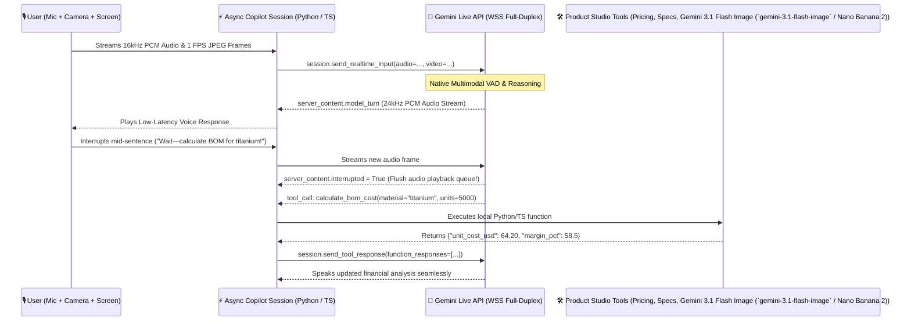

# Module 03: Live Models, Agents, Antigravity SDK & Apps

> **Navigation:** [← Module 02: Basics, Prompts & Media Gen](../module-02-basics-prompts-media-llms/README.md) | [Course Home (`../README.md`)](../README.md) | **Next:** [Module 04: Deployment, GitHub, Cloud Run & Security →](../module-04-deploy-github-cloudrun-security/README.md)

Welcome to **Module 03**—where your applications come alive! Traditional request/response LLM APIs force users to type a prompt, wait for text tokens, and manually copy results into other tools. In this module, we shatter those boundaries by combining three transformative capabilities:
1. **The Gemini Live API (`client.aio.live.connect`)**: Low-latency, full-duplex bidirectional streaming of **raw PCM audio, live video frames, and text over WebSockets** with native **Voice Activity Detection (VAD) and barge-in interruption handling**.
2. **Autonomous Function Calling & Tool-Use Loops**: Equipping Gemini models with real Python/TypeScript tools so they can query pricing databases, inspect inventory, and trigger our **Stage 1 Creative Engine** mid-conversation.
3. **The Google Antigravity SDK & Harness (`https://antigravity.google`)**: Understanding how Google's agent-first development platform and SDK orchestrate multi-step planning, workspace tools, and autonomous software agents.

---

## 🎯 Learning Objectives

By the end of this module, you will be able to:
1. Establish persistent, asynchronous WebSocket sessions with the **Gemini Live API** (`client.aio.live.connect`) in Python and TypeScript.
2. Stream real-time **16kHz PCM audio input**, receive **24kHz native voice output**, send live camera/screen JPEG frames, and handle **barge-in interruptions** (`server_content.interrupted`).
3. Architect deterministic and autonomous **Tool / Function Calling Loops** using automatic Python function declarations and manual tool response dispatch.
4. Explain the architecture of **Google Antigravity** (`https://antigravity.google`) and integrate the **Antigravity SDK** patterns into agentic workflows.
5. Build **Stage 2 of the Flagship Milestone Project**: the **Live Multimodal Product Copilot & Autonomous Tool Agent**.

---

## 🏗️ Architecture Diagram: Full-Duplex Gemini Live API & Tool Agent Loop



---

## 1. Deep Conceptual Walkthrough: The Gemini Live API (`client.aio.live.connect`)

Unlike standard HTTP streaming (`generate_content_stream`), the **Gemini Live API** maintains a stateful, bidirectional WebSocket connection where:
- **Multimodal Inputs Flow Continuously:** You can stream microphone audio chunks (`audio/pcm;rate=16000`), webcam or screen-share frames (`image/jpeg`), and text messages simultaneously.
- **Native Audio Synthesis:** Instead of piping text through a separate Text-to-Speech (TTS) service that loses emotional nuance and adds 500ms of latency, Gemini synthesizes expressive voice audio directly from its multimodal representation.
- **Native Voice Activity Detection (VAD) & Barge-In:** If the user speaks while the model is talking, the Live API detects the interruption immediately, stops generating the stale turn, and sends `server_content.interrupted = True` so your client can clear its audio output buffer immediately.

---

## 2. Autonomous Agents & Function Calling Architecture

A language model becomes an **Agent** when it can observe its environment, reason about a goal, invoke external **Tools (Functions)**, inspect the results, and iterate until the goal is achieved.

### Two Ways to Execute Tools with `google-genai`
1. **Automatic Function Calling (Standard `generate_content`):**
   Pass Python functions directly in `config=types.GenerateContentConfig(tools=[fn1, fn2])`. The `google-genai` SDK automatically inspects type hints and docstrings, generates the OpenAPI function declarations, executes the Python function when requested by Gemini, feeds the result back to the model, and returns the final answer!
2. **Explicit Async Tool Dispatch (Gemini Live API & Custom Agent Loops):**
   In a real-time Live API session, the server emits a `tool_call` event containing one or more `function_calls`. Your async loop executes each function and sends the result back via `await session.send_tool_response(function_responses=[...])`.

---

## 3. Deep Dive: Google Antigravity SDK & Agent Harness (`https://antigravity.google`)

As your agent loops grow from single tool calls into multi-step software engineering and product operations, you encounter the need for an **Agent Harness**—a structured runtime that manages context windows, workspace files, terminal execution, browser verification, and subagent delegation.

### What is Google Antigravity?
**[Google Antigravity](https://antigravity.google)** is Google's agent-first development platform and SDK ecosystem powered by Gemini models. While Google AI Studio is your **Model & API Playground**, Google Antigravity is your **Autonomous Agent Workspace & Orchestration Engine**.

| Capability | Raw `google-genai` API Calls | Google Antigravity (`https://antigravity.google`) |
| :--- | :--- | :--- |
| **Primary Abstraction** | Tokens, Prompts, `GenerateContentConfig`, WebSockets | **Agents, Tasks, Artifacts, Skills (`SKILL.md`), Rules & MCP Servers** |
| **Execution Scope** | Single request or single live session | Multi-file repository editing, terminal command execution, browser testing |
| **Extensibility** | Custom function declarations | Standardized **Skills**, **Workspace Rules (`.agents/rules/`)**, and **Model Context Protocol (MCP)** |
| **Parallelism** | Manual `asyncio.gather()` | Native **Subagent Orchestration** (spawning specialized researcher/implementer/reviewer agents) |

In the **Surprise Finisher** module at the end of this course, you will graduate your entire codebase into a live **Google Antigravity** workspace!

---

## 🛠️ Hands-On Build: Stage 2 of the Flagship Project (`Live Multimodal Copilot & Tool Agent`)

Let's build **Stage 2 of our AI Product Studio**: an asynchronous **Gemini Live API Copilot** equipped with live tool execution that can:
1. Calculate hardware Bill of Materials (BOM) and retail margins (`calculate_bom_and_margin`).
2. Trigger our **Stage 1 Creative Engine** (`generate_studio_hero_asset`) on command during a live session.
3. Maintain full-duplex bidirectional communication over `client.aio.live.connect`.

### Complete Python Implementation (`stage2_live_copilot_agent.py`)

```python
"""
Flagship Milestone Project — Stage 2: Live Multimodal Copilot & Autonomous Tool Agent
Uses `client.aio.live.connect` from the official `google-genai` SDK.
"""

import asyncio
from typing import Any, Dict
from google import genai
from google.genai import types


# ---------------------------------------------------------------------------
# 1. Define Callable Tools for the Live Copilot
# ---------------------------------------------------------------------------
def calculate_bom_and_margin(
    material: str,
    estimated_units: int,
    target_retail_price_usd: float,
) -> Dict[str, Any]:
    """Calculates unit Bill of Materials (BOM) cost and gross margin percentage.

    Args:
        material: Primary enclosure material ('aluminum', 'titanium', 'polycarbonate').
        estimated_units: Manufacturing production run volume.
        target_retail_price_usd: Target MSRP in US dollars.
    """
    base_costs = {"aluminum": 42.0, "titanium": 68.5, "polycarbonate": 19.0}
    material_cost = base_costs.get(material.lower(), 35.0)
    volume_discount = 0.85 if estimated_units >= 5000 else 1.0
    unit_bom = round(material_cost * volume_discount + 18.50, 2)
    margin_pct = round(((target_retail_price_usd - unit_bom) / target_retail_price_usd) * 100, 1)

    return {
        "material": material,
        "unit_bom_usd": unit_bom,
        "target_retail_price_usd": target_retail_price_usd,
        "gross_margin_percent": margin_pct,
        "recommendation": "HEALTHY_MARGIN" if margin_pct >= 50 else "OPTIMIZE_BOM",
    }


def trigger_hero_render_job(product_name: str, visual_style: str) -> Dict[str, str]:
    """Queues an Gemini 3.1 Flash Image (`gemini-3.1-flash-image` / Nano Banana 2) studio render job for the active product design session.

    Args:
        product_name: Name of the product concept.
        visual_style: Lighting and camera style description.
    """
    return {
        "status": "RENDER_COMPLETE",
        "asset_path": f"./renders/{product_name.lower().replace(' ', '_')}_hero.png",
        "applied_style": visual_style,
    }


TOOL_REGISTRY = {
    "calculate_bom_and_margin": calculate_bom_and_margin,
    "trigger_hero_render_job": trigger_hero_render_job,
}


# ---------------------------------------------------------------------------
# 2. Full-Duplex Gemini Live API Session with Tool Execution Loop
# ---------------------------------------------------------------------------
async def run_live_product_copilot() -> None:
    client = genai.Client()

    live_config = types.LiveConnectConfig(
        response_modalities=["TEXT"],  # Switch to ["AUDIO"] for 24kHz PCM voice output
        system_instruction=types.Content(
            parts=[
                types.Part.from_text(
                    text=(
                        "You are the Live Multimodal AI Product Studio Copilot. "
                        "Help the founder refine hardware specs, run BOM margin simulations "
                        "using `calculate_bom_and_margin`, and trigger renders using `trigger_hero_render_job`."
                    )
                )
            ]
        ),
        tools=[calculate_bom_and_margin, trigger_hero_render_job],
    )

    print("🎙️ Connecting to Gemini Live API Full-Duplex Session...")
    async with client.aio.live.connect(
        model="gemini-3.8-live",
        config=live_config,
    ) as session:
        print("✅ Connected! Sending live founder prompt...")

        await session.send_client_content(
            turns=types.Content(
                role="user",
                parts=[
                    types.Part.from_text(
                        text=(
                            "We are designing the 'AuraField Pro' recorder in titanium for a 10,000-unit run "
                            "at a $199 retail price. Check our BOM margin and trigger a dramatic studio render!"
                        )
                    )
                ],
            ),
            turn_complete=True,
        )

        # Process real-time server events (Text, Audio, Barge-In, and Tool Calls)
        async for message in session.receive():
            # 1. Handle Barge-In Interruption
            if message.server_content and message.server_content.interrupted:
                print("\n⚠️ [BARGE-IN DETECTED] Clearing client audio playback buffer!")

            # 2. Handle Model Text / Audio Output
            if message.server_content and message.server_content.model_turn:
                for part in message.server_content.model_turn.parts:
                    if part.text:
                        print(part.text, end="", flush=True)

            # 3. Handle Autonomous Tool / Function Calls
            if message.tool_call:
                function_responses = []
                for fn_call in message.tool_call.function_calls:
                    print(f"\n🛠️  [LIVE TOOL CALL] Executing `{fn_call.name}` with args={fn_call.args}")
                    fn = TOOL_REGISTRY[fn_call.name]
                    result = fn(**fn_call.args)
                    print(f"📦 [TOOL RESULT] {result}")

                    function_responses.append(
                        types.FunctionResponse(
                            id=fn_call.id,
                            name=fn_call.name,
                            response={"result": result},
                        )
                    )

                await session.send_tool_response(function_responses=function_responses)

            if message.server_content and message.server_content.turn_complete:
                print("\n\n✅ Live Copilot Turn Complete!")
                break


if __name__ == "__main__":
    asyncio.run(run_live_product_copilot())
```

### Complete TypeScript Implementation (`stage2_live_copilot_agent.ts`)

```typescript
/**
 * Flagship Milestone Project — Stage 2: Live Multimodal Copilot (TypeScript)
 * Uses `ai.live.connect` from the official `@google/genai` SDK.
 */

import { GoogleGenAI, Modality } from "@google/genai";

const ai = new GoogleGenAI({ apiKey: process.env.GEMINI_API_KEY });

async function startLiveCopilotSession() {
  const session = await ai.live.connect({
    model: "gemini-3.8-live",
    config: {
      responseModalities: [Modality.TEXT],
      systemInstruction:
        "You are the Live Multimodal AI Product Studio Copilot helping engineers design hardware.",
    },
    callbacks: {
      onopen: () => console.log("✅ Connected to Gemini Live API WebSocket!"),
      onmessage: (msg) => {
        if (msg.serverContent?.interrupted) {
          console.log("⚠️ User interrupted! Flushing audio buffer.");
        }
        const parts = msg.serverContent?.modelTurn?.parts ?? [];
        for (const part of parts) {
          if (part.text) process.stdout.write(part.text);
        }
      },
      onerror: (err) => console.error("❌ Live API Error:", err),
      onclose: () => console.log("\n🔌 Session closed."),
    },
  });

  await session.sendClientContent({
    turns: [
      {
        role: "user",
        parts: [{ text: "Give me 3 rapid industrial design tips for anodized titanium enclosures." }],
      },
    ],
    turnComplete: true,
  });
}

startLiveCopilotSession().catch(console.error);
```

---

## 🧩 Connection to the Flagship Milestone Project

We now have **both core engines** of our Flagship Milestone Project:
1. **Stage 1 (`stage1_creative_engine.py`)**: High-precision structured specification synthesis + Gemini 3.1 Flash Image (`gemini-3.1-flash-image` / Nano Banana 2) + Gemini Omni 1.1 Flash (`gemini-omni-1.1-flash`) media generation.
2. **Stage 2 (`stage2_live_copilot_agent.py`)**: Full-duplex real-time Gemini Live API streaming + autonomous tool execution.

In **Module 04**, we will wrap Stage 1 and Stage 2 inside a hardened **FastAPI + WebSocket server**, containerize it with **Docker**, wire automated zero-secret CI/CD via **GitHub Actions + Workload Identity Federation**, add defense-in-depth **App Security**, and deploy it live to **Google Cloud Run**!

---

## 📝 Module 03 Self-Assessment Quiz

<details>
<summary><strong>Question 1: What event flag does the Gemini Live API emit when a user speaks over the model mid-response (barge-in)?</strong></summary>

**Answer:**
The server sets `message.server_content.interrupted = True`. Your client application must listen for this flag and immediately stop playing queued audio chunks so the conversation feels natural and instantaneous.
</details>

<details>
<summary><strong>Question 2: How does your application return the output of a function call during a Gemini Live API session?</strong></summary>

**Answer:**
When `message.tool_call` arrives, your code executes each requested function call (`fn_call.name` / `fn_call.args`), constructs `types.FunctionResponse(id=fn_call.id, name=fn_call.name, response={"result": ...})`, and sends them back over the WebSocket via `await session.send_tool_response(function_responses=[...])`.
</details>

<details>
<summary><strong>Question 3: How does Google Antigravity (`https://antigravity.google`) complement Google AI Studio?</strong></summary>

**Answer:**
**Google AI Studio** is the developer workbench for prototyping prompts, testing Gemini 3.x / Gemini Image / Gemini Omni endpoints, and managing API keys. **Google Antigravity** (`https://antigravity.google`) is Google's agent-first development platform and SDK harness that orchestrates autonomous multi-step coding, workspace rules (`.agents/rules/`), reusable skills (`SKILL.md`), MCP tools, and parallel subagents across full codebases.
</details>

---

## 🔗 Verified Public References & Official Documentation

- **Gemini Live API (Bidirectional Multimodal Streaming):** [https://ai.google.dev/gemini-api/docs/live](https://ai.google.dev/gemini-api/docs/live)
- **Function Calling & Tool Use Guide:** [https://ai.google.dev/gemini-api/docs/function-calling](https://ai.google.dev/gemini-api/docs/function-calling)
- **Google Antigravity Official Platform:** [https://antigravity.google](https://antigravity.google)
- **Google Antigravity Official Documentation:** [https://antigravity.google/docs](https://antigravity.google/docs)
- **Official Python SDK Async & Live Client (`google-genai`):** [https://github.com/googleapis/python-genai](https://github.com/googleapis/python-genai)
- **Official TypeScript SDK Live Client (`@google/genai`):** [https://github.com/googleapis/js-genai](https://github.com/googleapis/js-genai)

---

👉 **Next Module: [Module 04: Production Deployment, GitHub Integration, Cloud Run, App Security & Milestone Project →](../module-04-deploy-github-cloudrun-security/README.md)**
