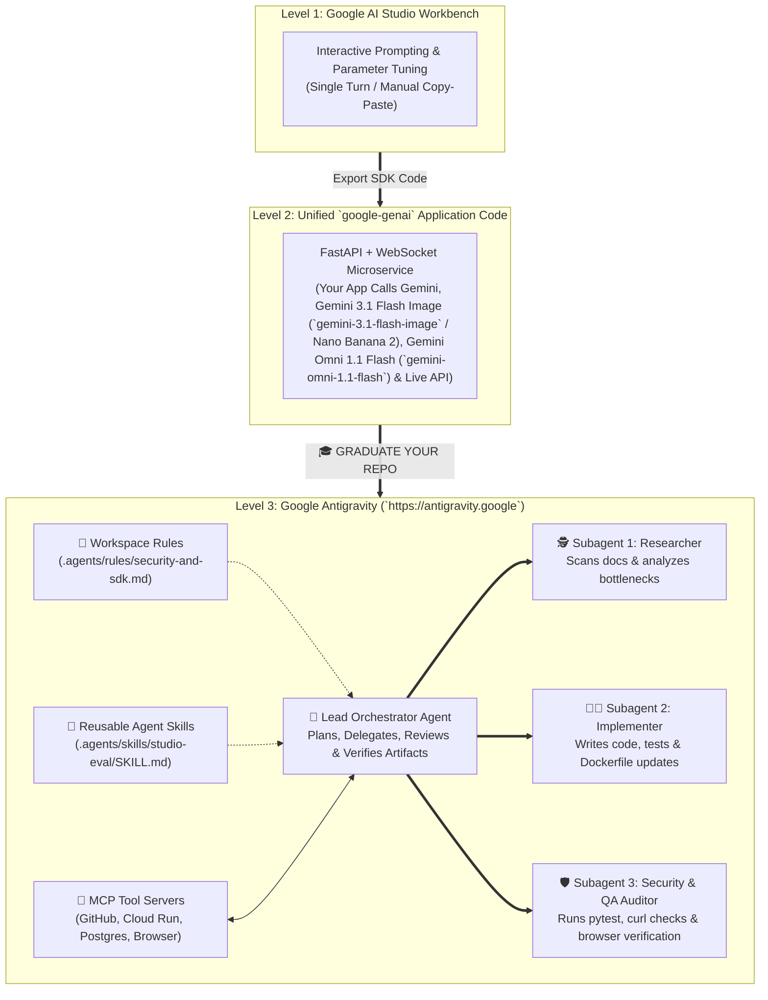

# 🎓 Surprise Finisher: I Want to Graduate to Use Antigravity (`antigravity.google`)

> **Navigation:** [← Module 04: Production Deployment & Cloud Run](../module-04-deploy-github-cloudrun-security/README.md) | [Course Home (`../README.md`)](../README.md) | **Next:** [Master References Directory →](../REFERENCES.md)

Congratulations! Across Modules 01 through 04, you went from creating your first API key in **Google AI Studio** to deploying a hardened, multimodal, real-time **AI Product Studio & Live Copilot** on **Google Cloud Run**.

Now it is time for the **Surprise Finisher**—the paradigm shift that separates developers who merely *call* AI models from engineers who *orchestrate autonomous AI engineering teams*:

> **Graduating from writing single API calls in Google AI Studio to orchestrating multi-agent, self-evolving software systems inside [Google Antigravity](https://antigravity.google).**

---

## 🎯 Learning Objectives

By the end of this finisher module, you will be able to:
1. Articulate the architectural evolution across the three stages of AI engineering: **Prompting (AI Studio UI)** → **Programmatic Pipelines (`google-genai` SDK)** → **Autonomous Agentic Engineering (`https://antigravity.google`)**.
2. Connect your existing **Google AI Studio API Key** and **Google Cloud Project** directly into **Google Antigravity**.
3. Encode institutional engineering standards into your repository using **Antigravity Workspace Rules (`.agents/rules/`)**.
4. Author modular, reusable **Agent Skills (`SKILL.md`)** that teach Antigravity agents how to execute domain-specific workflows autonomously.
5. Connect external tools, databases, and cloud infrastructure via **Model Context Protocol (MCP)** servers.
6. Dispatch parallel subagents (**Researcher**, **Implementer**, **Security Auditor**) using the **Antigravity SDK** to autonomously extend and verify your **Flagship Milestone Project**.

---

## 🏗️ Architecture Diagram: The Graduation Paradigm Shift



---

## 1. Why Graduate to Google Antigravity?

When you build inside **Google AI Studio**, *you* are the orchestrator: you prompt the model, inspect the output, copy the code into your editor, run `pytest`, read the stack trace, and prompt again.

When you open your repository inside **[Google Antigravity](https://antigravity.google)**, the agent has **direct, permission-governed agency** over:
- **Your Multi-File Codebase:** Reading, searching, refactoring, and editing files across frontend, backend, and infrastructure.
- **Your Terminal & Build Loop:** Running `pytest`, `uvicorn`, `docker build`, and `gcloud run deploy`, reading test failures in real time, and autonomously fixing broken assertions.
- **Integrated Headless & Visual Browser:** Launching your web app, clicking buttons, inspecting console errors, recording verification artifacts, and validating UI layouts visually.
- **Structured Artifacts & Task Plans:** Producing reviewable Implementation Plans, Walkthroughs, Diffs, and Verification Checklists before touching critical production code.

---

## 2. Step-by-Step Guide: Upgrading Your Milestone Project into an Antigravity Workspace

Let's equip our **AI Product Studio & Live Multimodal Copilot** repository with three native Antigravity superpowers: **Workspace Rules**, **Custom Agent Skills**, and **Parallel Multi-Agent Orchestration**.

### Step 1: Author Workspace Rules (`.agents/rules/ai-product-studio.md`)

Workspace Rules are persistent architectural mandates that every Antigravity agent automatically obeys whenever it touches your repository. Create `.agents/rules/ai-product-studio.md`:

```markdown
# Workspace Rules: AI Product Studio & Live Multimodal Copilot

## Mandatory SDK & Model Standards
1. **Unified SDK Only:** Always use the official `google-genai` Python SDK (`from google import genai`, `client = genai.Client()`) or `@google/genai` TypeScript SDK. NEVER import the deprecated `google-generativeai` package.
2. **Structured Outputs:** Any endpoint returning structured data MUST enforce `response_mime_type="application/json"` with a validated Pydantic `BaseModel` schema (`response_schema=...`).
3. **Security Guardrails:** Every user-facing prompt input MUST pass through `sanitize_user_brief()` and be wrapped inside `<untrusted_user_brief>...</untrusted_user_brief>` XML tags.
4. **Verification Before Completion:** Never mark a task complete without running `pytest` and verifying `/healthz` returns HTTP 200.
```

### Step 2: Create a Reusable Custom Agent Skill (`.agents/skills/add-studio-tool/SKILL.md`)

In Google Antigravity, a **Skill** is a self-contained folder containing a `SKILL.md` file with YAML frontmatter (`name` and `description`) plus step-by-step instructions, scripts, or templates. When you ask Antigravity to add a new capability to your Live Copilot, it automatically discovers and follows this skill!

Create `.agents/skills/add-studio-tool/SKILL.md`:

```markdown
---
name: add-studio-tool
description: Adds, registers, and unit-tests a new callable function tool for the Stage 2 Gemini Live API Copilot and Stage 3 FastAPI server. Use whenever the user asks to add a new live tool, calculator, or external integration to the copilot.
---

# Skill: Add a Verified Tool to the Live Multimodal Copilot

Follow this exact 4-step workflow whenever adding a new tool to the AI Product Studio Copilot:

1. **Author the Typed Tool Function:**
   - Write a pure Python function with complete type annotations and a Google-style docstring (`Args:` and `Returns:`).
   - Ensure the return value is a JSON-serializable `dict`.
2. **Register in `TOOL_REGISTRY`:**
   - Add the function to `TOOL_REGISTRY` and include it in `tools=[...]` inside `types.LiveConnectConfig`.
3. **Write Automated Unit Tests:**
   - Add a test case in `tests/test_tools.py` covering valid inputs and edge cases.
4. **Run Verification:**
   - Execute `pytest tests/test_tools.py` and confirm 100% pass rate before reporting completion.
```

---

## 🛠️ Hands-On Code: Programmatic Multi-Agent Orchestration Pattern (Python & TypeScript)

Whether you invoke agents inside the **Google Antigravity IDE (`https://antigravity.google`)** or build your own multi-agent harness using the **Google Gen AI & Antigravity SDK patterns**, the core architectural secret is **Specialized Subagent Decomposition with Parallel Execution**.

Below is a complete, runnable **Multi-Agent Orchestrator** that dispatches three specialized Gemini 3.7 / 3.1 agents in parallel (**Product Architect**, **Security Auditor**, and **FinOps Cost Optimizer**) and synthesizes their findings into an executive engineering blueprint.

### Python Implementation (`graduate_multi_agent_orchestrator.py`)

```python
"""
Surprise Finisher: Multi-Agent Orchestration Harness (Antigravity Pattern)
Dispatches 3 specialized subagents concurrently and synthesizes an executive blueprint.
"""

import asyncio
from typing import Dict
from google import genai
from google.genai import types


SUBAGENT_PERSONAS: Dict[str, str] = {
    "ProductArchitect": (
        "You are the Principal Multimodal Systems Architect. Analyze the feature request and "
        "specify exact Gemini 3.7 / 3.1 / Gemini 3.1 Flash Image (`gemini-3.1-flash-image` / Nano Banana 2) / Gemini Omni 1.1 Flash (`gemini-omni-1.1-flash`) / Live API endpoints, schemas, and latency budgets."
    ),
    "SecurityAuditor": (
        "You are the Lead AI Security & Red-Team Auditor. Identify prompt injection vectors, "
        "IAM permission requirements, Secret Manager bindings, and rate-limit rules for this feature."
    ),
    "FinOpsOptimizer": (
        "You are the Cloud FinOps & Token Economics Specialist. Recommend thinking_budget settings, "
        "context caching strategies, and Flash vs. Pro routing rules to cut token spend by 50%+."
    ),
}


async def run_specialized_subagent(
    client: genai.Client,
    role_name: str,
    system_prompt: str,
    feature_spec: str,
) -> Dict[str, str]:
    print(f"🤖 Spawning Subagent [{role_name}]...")
    response = await client.aio.models.generate_content(
        model="gemini-3.7-flash",
        contents=feature_spec,
        config=types.GenerateContentConfig(
            system_instruction=system_prompt,
            thinking_config=types.ThinkingConfig(thinking_budget=1024),
            temperature=0.2,
        ),
    )
    print(f"✅ Subagent [{role_name}] completed analysis.")
    return {"role": role_name, "report": response.text or ""}


async def orchestrate_feature_evolution(feature_request: str) -> None:
    client = genai.Client()

    print("=" * 76)
    print("🎓 GOOGLE ANTIGRAVITY PATTERN — PARALLEL MULTI-AGENT ORCHESTRATOR")
    print("=" * 76)

    # 1. Dispatch all 3 specialized subagents in parallel
    tasks = [
        run_specialized_subagent(client, role, prompt, feature_request)
        for role, prompt in SUBAGENT_PERSONAS.items()
    ]
    subagent_reports = await asyncio.gather(*tasks)

    # 2. Synthesize subagent findings with the Lead Orchestrator Agent (Gemini 3.1 Pro)
    combined_context = "\n\n".join(
        f"### Report from {item['role']}\n{item['report']}" for item in subagent_reports
    )

    print("\n🧠 Lead Orchestrator synthesizing final Implementation Plan...")
    final_plan = await client.aio.models.generate_content(
        model="gemini-3.1-pro",
        contents=(
            f"Feature Request: {feature_request}\n\n"
            f"Subagent Reports:\n{combined_context}\n\n"
            "Synthesize a unified, step-by-step Production Implementation Plan."
        ),
        config=types.GenerateContentConfig(
            system_instruction="You are the Lead Staff Engineer orchestrating autonomous subagents.",
            thinking_config=types.ThinkingConfig(thinking_budget=2048),
            temperature=0.2,
        ),
    )

    print("\n" + "=" * 76)
    print("📋 FINAL SYNTHESIZED IMPLEMENTATION PLAN")
    print("=" * 76)
    print(final_plan.text)


if __name__ == "__main__":
    asyncio.run(
        orchestrate_feature_evolution(
            "Add live competitor packaging visual comparison to the AI Product Studio Copilot "
            "using webcam video frames + Gemini 3.1 Flash Image (`gemini-3.1-flash-image` / Nano Banana 2) side-by-side mockups."
        )
    )
```

---

## 📝 Graduation Self-Assessment Quiz

<details>
<summary><strong>Question 1: What is the purpose of placing `.agents/rules/*.md` and `.agents/skills/*/SKILL.md` files inside your repository when working with Google Antigravity?</strong></summary>

**Answer:**
`.agents/rules/` enforces persistent project-wide architectural, security, and SDK conventions across every agent turn, while `.agents/skills/*/SKILL.md` packages modular, discoverable step-by-step workflows that teach agents how to perform specialized engineering tasks autonomously.
</details>

<details>
<summary><strong>Question 2: Why is parallel subagent orchestration (`asyncio.gather` across specialized agents + Lead Orchestrator synthesis) superior to a single monolithic prompt for complex engineering tasks?</strong></summary>

**Answer:**
Parallel subagents isolate context windows so each specialist (Architecture, Security, FinOps) can reason deeply without context dilution, complete all analyses concurrently in the wall-clock time of the single slowest call, and feed high-signal structured reports to the Lead Orchestrator.
</details>

---

## 🔗 Verified Public References & Official Documentation

- **Google Antigravity Official Platform:** [https://antigravity.google](https://antigravity.google)
- **Google Antigravity Documentation & Guides:** [https://antigravity.google/docs](https://antigravity.google/docs)
- **Google AI Studio Workbench:** [https://aistudio.google.com](https://aistudio.google.com)
- **Model Context Protocol (MCP) Open Specification:** [https://modelcontextprotocol.io](https://modelcontextprotocol.io)
- **Official Python SDK (`google-genai`):** [https://github.com/googleapis/python-genai](https://github.com/googleapis/python-genai)
- **Official TypeScript SDK (`@google/genai`):** [https://github.com/googleapis/js-genai](https://github.com/googleapis/js-genai)

---

👉 **Explore the complete index of official documentation and public resources: [Master References Directory (`../REFERENCES.md`) →](../REFERENCES.md)**
