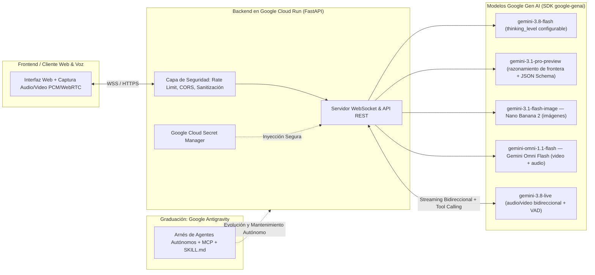

# Curso Completo de Google AI Studio y Gemini API: De Cero a Experto (Zero to Hero)

[](https://aistudio.google.com)
[](https://github.com/googleapis/python-genai)
[](https://cloud.google.com/run)
[](https://antigravity.google)

Bienvenido al curso práctico integral en español para dominar **Google AI Studio**, el **SDK unificado de Google Gen AI (`google-genai`)**, la **Interactions API**, la **Live API**, el despliegue seguro en **Google Cloud Run** y la orquestación de agentes autónomos con **Google Antigravity**.

Este repositorio está diseñado bajo un enfoque **De Cero a Experto (Zero to Hero)**: comenzamos desde la creación de tu primera llave de API y la configuración de permisos IAM de mínimo privilegio, y avanzamos paso a paso hasta desplegar en producción un **Copiloto Multimodal en Vivo y Estudio Creativo de Productos (AI Product Studio)** con CI/CD sin llaves estáticas (Workload Identity Federation).

---

## Tabla de Modelos Vigentes (2026)

Esta es la lista de modelos que usamos en **todo** el curso. Si un tutorial que encuentres por internet menciona otro identificador, contrástalo primero con esta tabla y con el [catálogo oficial de modelos](https://ai.google.dev/gemini-api/docs/models).

| Para qué lo usas | Modelo | Nombre comercial | Estado |
| :--- | :--- | :--- | :--- |
| Texto, razonamiento, agentes (por defecto) | `gemini-3.8-flash` | Gemini 3.8 Flash | Estable |
| Razonamiento de frontera, código complejo | `gemini-3.1-pro-preview` | Gemini 3.1 Pro | Vista previa |
| Alto volumen y bajo costo | `gemini-3.5-flash-lite` | Gemini 3.5 Flash Lite | Estable |
| Imágenes (por defecto) | `gemini-3.1-flash-image` | **Nano Banana 2** | Estable |
| Imágenes de máxima calidad y texto nítido | `gemini-3-pro-image` | **Nano Banana Pro** | Estable |
| Imágenes de latencia mínima | `gemini-3.1-flash-lite-image` | **Nano Banana 2 Lite** | Estable |
| Video con audio sincronizado | `gemini-omni-1.1-flash` | **Gemini Omni Flash** | Actual |
| Voz y video en tiempo real | `gemini-3.8-live` | Gemini 3.8 Live | Estable |
| Voz en tiempo real con razonamiento de fondo | `gemini-3.8-live-extended-thinking` | Gemini 3.8 Live Extended Thinking | Estable |
| Transcripción de audio | `gemini-3.5-transcribe` | Gemini 3.5 Transcribe | Estable |
| Síntesis de voz (TTS) | `gemini-3.1-flash-tts-preview` | Gemini 3.1 Flash TTS | Vista previa |
| Embeddings | `gemini-embedding-2` | Gemini Embedding 2 | Estable |

### Migración: Legado → Actual

> [!IMPORTANT]
> Si vienes de un tutorial, un curso grabado o un repositorio de 2024–2025, es muy probable que encuentres los identificadores de la columna izquierda. **Ya no los uses.** Esta tabla existe para que traduzcas cualquier ejemplo viejo a la API actual sin confundirte.

| Legado (no lo uses) | Actual (úsalo siempre) |
| :--- | :--- |
| `gemini-3.1-flash-image.0-generate-002`, `client.models.generate_images()` | `gemini-3.1-flash-image` vía `client.interactions.create(...)` con `response_format={"type": "image"}` |
| `veo-3.1-generate-preview`, `client.models.generate_videos()` | `gemini-omni-1.1-flash` vía `client.interactions.create(...)` con `response_format={"type": "video"}` |
| `gemini-3.8-flash` como modelo por defecto | `gemini-3.8-flash` |
| `gemini-3.8-pro` como modelo de frontera | `gemini-3.1-pro-preview` |
| `gemini-3.8-live` | `gemini-3.8-live` |
| `thinking_budget=2048` (presupuesto numérico) | `generation_config={"thinking_level": "medium"}` |
| `response_mime_type` + `response_schema` en `GenerateContentConfig` | `response_format={"type": "text", "mime_type": "application/json", "schema": MiModelo.model_json_schema()}` |
| `client.models.generate_content()` como vía principal | `client.interactions.create()` (la vía clásica sigue funcionando) |

---

## Arquitectura General del Curso y del Proyecto Hito

A lo largo de los 4 módulos y el cierre sorpresa, construirás y evolucionarás una aplicación real de nivel productivo: **AI Product Studio & Copiloto Multimodal en Vivo**.



---

## Hoja de Ruta del Currículo (Curriculum Roadmap)

| Módulo | Título y Enfoque Técnico | Hito del Proyecto (Flagship Milestone) |
| :--- | :--- | :--- |
| **[Módulo 1](./module-01-setup-iam-billing/README.md)** | **Configuración e Introducción, Permisos IAM, Facturación, Usuarios y Panel de Control** | Configuración del entorno, comparativa AI Studio vs. Vertex AI, cuotas RPM/TPM/RPD, roles IAM de mínimo privilegio (`roles/aiplatform.user`, `roles/secretmanager.secretAccessor`, `roles/run.invoker`) y alertas de presupuesto. |
| **[Módulo 2](./module-02-basics-prompts-media-llms/README.md)** | **Fundamentos, Prompts, Instrucciones del Sistema, Generación Multimedia y Modelos de Lenguaje** | **Etapa 1 del Proyecto Hito**: Motor Creativo de *AI Product Studio* con la Interactions API, `thinking_level`, salidas estructuradas con Pydantic/Zod, Nano Banana (`gemini-3.1-flash-image`) y Gemini Omni Flash (`gemini-omni-1.1-flash`). |
| **[Módulo 3](./module-03-live-agents-antigravity-sdk/README.md)** | **Modelos en Vivo (Live API), Agentes, Antigravity SDK y Aplicaciones** | **Etapa 2 del Proyecto Hito**: Copiloto Multimodal en Vivo con streaming WebSocket bidireccional (`client.aio.live.connect` sobre `gemini-3.8-live`), interrupciones de voz (*barge-in*), Function Calling y el SDK público de Google Antigravity (`antigravity.google`). |
| **[Módulo 4](./module-04-deploy-github-cloudrun-security/README.md)** | **Despliegue a Producción, Integración con GitHub, Cloud Run, Seguridad en tu App y Proyecto Hito** | **Etapa 3 del Proyecto Hito**: Contenedorización Docker, CI/CD con GitHub Actions + Workload Identity Federation (`google-github-actions/auth@v2`), Secret Manager, defensa contra inyección de prompts y despliegue en Cloud Run. |
| **[Cierre Sorpresa](./surprise-finisher-graduate-to-antigravity/README.md)** | **Graduación hacia Google Antigravity (`antigravity.google`)** | El salto de paradigma: de invocar APIs en scripts a orquestar agentes autónomos de ingeniería con `.agents/rules/`, `SKILL.md`, servidores MCP y subagentes paralelos. |
| **[Referencias](./REFERENCES.md)** | **Directorio Maestro de Referencias Públicas Verificadas** | Compendio completo de documentación oficial, SDKs, guías de seguridad y repositorios públicos. |

---

## Prerrequisitos Técnicos

Para aprovechar al máximo todos los laboratorios de este curso, asegúrate de contar con:

1. **Cuenta de Google y acceso a Google AI Studio**: Ingresa a [https://aistudio.google.com](https://aistudio.google.com) para generar tu llave de API gratuita en segundos.
2. **Proyecto de Google Cloud Platform (GCP)**: Necesario para los laboratorios de IAM, Secret Manager, Vertex AI y despliegue en Cloud Run ([https://console.cloud.google.com](https://console.cloud.google.com)).
3. **Entorno de Desarrollo Local**:
   - **Python 3.10+** (recomendado 3.11 o 3.12).
   - **Node.js 20+** y **npm** para los ejemplos en TypeScript/JavaScript.
   - **Docker Desktop** o Docker Engine para empaquetar el microservicio.
   - **Google Cloud CLI (`gcloud`)** instalado y autenticado.
   - **Cuenta de GitHub** para configurar el pipeline CI/CD con GitHub Actions.

---

## Regla de Oro del SDK: Usa Siempre el SDK Unificado `google-genai`

> [!IMPORTANT]
> **Aviso Crítico de Ecosistema**: En todos los módulos de este curso utilizamos exclusivamente el **SDK unificado oficial de Google Gen AI**:
> - **Python**: `pip install google-genai` (`from google import genai`)
> - **TypeScript / JavaScript**: `npm install @google/genai` (`import { GoogleGenAI } from '@google/genai'`)
>
> **NUNCA utilices el paquete heredado y obsoleto `google-generativeai`**. El SDK `google-genai` te permite cambiar entre llaves de API de Google AI Studio y autenticación empresarial de Vertex AI con una sola línea de configuración, y es el único que expone la **Interactions API**, la **Live API**, Nano Banana y Gemini Omni Flash.

### La Superficie Estándar: `client.interactions.create`

> [!NOTE]
> La **[Interactions API](https://ai.google.dev/gemini-api/docs/interactions-overview)** es la superficie moderna de la Gemini API y la que usamos por defecto en todo el curso. Mantiene el estado de la conversación **en el servidor** (encadenas turnos con `previous_interaction_id` en lugar de reenviar el historial completo) y es la vía obligatoria para generar imágenes y video.
>
> `client.models.generate_content` sigue funcionando y lo mostramos como la vía clásica/compatible en el Módulo 1 (y de nuevo en el Módulo 4 para los `safety_settings`, cuya forma documentada vive sobre `GenerateContentConfig`), para que reconozcas el estilo de código que verás en tutoriales anteriores. Si migras un proyecto existente, sigue la [guía oficial de migración](https://ai.google.dev/gemini-api/docs/migrate-to-interactions).

```python
from google import genai

client = genai.Client()

interaction = client.interactions.create(
    model="gemini-3.8-flash",
    input="Explica en dos frases qué es la Interactions API.",
    generation_config={"thinking_level": "low"},
)
print(interaction.output_text)
```

### Verificación Rápida de Instalación (30 Segundos)

Ejecuta estos comandos en tu terminal para validar que tu entorno está listo antes de iniciar el Módulo 1:

```bash
# Crear y activar un entorno virtual en Python
python3 -m venv .venv
source .venv/bin/activate

# Instalar el SDK oficial unificado de Google Gen AI y Pydantic
pip install -U google-genai pydantic fastapi uvicorn websockets

# Configurar tu llave de API obtenida en https://aistudio.google.com/apikey
export GEMINI_API_KEY="TU_LLAVE_AQUI"
```

---

## Cómo Navegar y Estudiar este Repositorio

1. **Sigue el orden secuencial**: Cada módulo construye sobre los componentes del anterior para dar forma al proyecto final **AI Product Studio & Copiloto Multimodal en Vivo**.
2. **Ejecuta los ejemplos bilingües (Python y TypeScript)**: Todos los conceptos clave incluyen implementaciones listas para copiar, pegar y ejecutar tanto en Python como en Node.js/TypeScript.
3. **Valida tu aprendizaje**: Al final de cada módulo encontrarás un **Cuestionario de Autoevaluación** con respuestas detalladas desplegables para comprobar tu dominio técnico antes de avanzar.
4. **Consulta la bibliografía oficial**: Cada módulo cierra con enlaces directos y verificados a la documentación oficial pública.

---

## Referencias Públicas Verificadas y Documentación Oficial

- [Google AI Studio — Portal Principal](https://aistudio.google.com)
- [Documentación Oficial de la API de Gemini](https://ai.google.dev/gemini-api/docs)
- [Catálogo Oficial de Modelos](https://ai.google.dev/gemini-api/docs/models)
- [Interactions API — Visión General](https://ai.google.dev/gemini-api/docs/interactions-overview)
- [Guía de Migración a la Interactions API](https://ai.google.dev/gemini-api/docs/migrate-to-interactions)
- [Generación de Imágenes con Nano Banana](https://ai.google.dev/gemini-api/docs/image-generation)
- [Generación de Video con Gemini Omni Flash](https://ai.google.dev/gemini-api/docs/omni)
- [Live API — Inicio Rápido con el SDK](https://ai.google.dev/gemini-api/docs/live-api/get-started-sdk)
- [SDK Oficial de Google Gen AI para Python (`google-genai`)](https://github.com/googleapis/python-genai)
- [SDK Oficial de Google Gen AI para TypeScript/JS (`@google/genai`)](https://github.com/googleapis/js-genai)
- [Google Antigravity — Plataforma y SDK de Agentes](https://antigravity.google)
- [Documentación de Google Cloud Run](https://cloud.google.com/run/docs)
