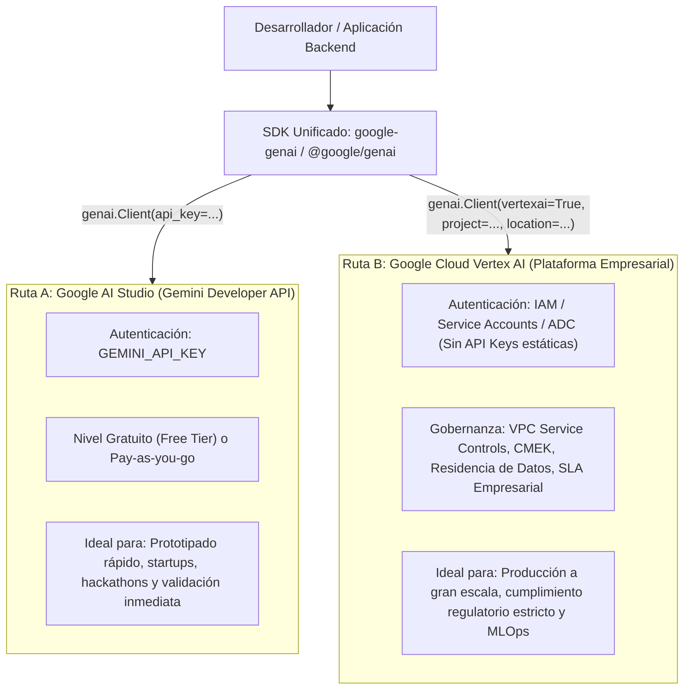

# Módulo 1: Configuración e Introducción, Permisos IAM, Facturación, Usuarios y Panel de Control

> **Objetivo del Módulo**: Comprender a fondo la arquitectura del ecosistema de IA generativa de Google, diferenciar cuándo usar **Google AI Studio (Gemini Developer API)** frente a **Vertex AI**, configurar autenticación segura mediante llaves de API y **Application Default Credentials (ADC)**, aplicar el principio de **mínimo privilegio con IAM**, controlar costos/cuotas y dominar cada sección del panel de control de AI Studio.

---

## 1. Arquitectura de Acceso: Google AI Studio vs. Vertex AI

Uno de los primeros dilemas de todo desarrollador o arquitecto de software al trabajar con los modelos Gemini es entender la relación entre **Google AI Studio** y **Google Cloud Vertex AI**. Gracias al SDK unificado `google-genai`, el código de tu aplicación es prácticamente idéntico, pero la capa de gobierno, facturación y autenticación cambia según la etapa del ciclo de vida de tu proyecto.



### Tabla Comparativa Técnica: AI Studio vs. Vertex AI

| Dimensión | Google AI Studio (Gemini Developer API) | Google Cloud Vertex AI |
| :--- | :--- | :--- |
| **Propósito Principal** | Experimentación veloz, desarrollo ágil y aplicaciones ligeras en producción. | Plataforma empresarial de IA/ML con gobierno corporativo y cumplimiento normativo. |
| **Mecanismo de Autenticación** | Llave de API (`GEMINI_API_KEY`). | Identidades de IAM, Cuentas de Servicio y Application Default Credentials (ADC). |
| **Nivel Gratuito (Free Tier)** | Sí, incluye un generoso nivel gratuito con límites por minuto/día. | No cuenta con nivel gratuito perpetuo; utiliza créditos iniciales de Google Cloud ($300 USD). |
| **Privacidad de Datos** | En el **Nivel Gratuito**, Google puede revisar prompts para mejorar productos. En el **Nivel de Pago (Pay-as-you-go)**, tus prompts y respuestas **NO** se utilizan para entrenar modelos. | Privacidad empresarial garantizada por contrato (Zero Data Retention opcional, CMEK y aislamiento de red VPC-SC). |
| **Migración de Código** | 100% compatible con el SDK `google-genai`. | 100% compatible con el mismo SDK cambiando únicamente la inicialización del cliente. |

---

## 2. Autenticación: Llaves de API vs. ADC y Cuentas de Servicio

### Opción A: Llaves de API (`GEMINI_API_KEY`) en Desarrollo Local

Para comenzar en segundos desde Google AI Studio ([https://aistudio.google.com/apikey](https://aistudio.google.com/apikey)):

1. Inicia sesión con tu cuenta de Google.
2. Haz clic en **"Get API key"** -> **"Create API key"**.
3. Asóciala a un proyecto de Google Cloud existente o crea uno nuevo automáticamente.
4. Guárdala en una variable de entorno llamada `GEMINI_API_KEY`. El SDK `google-genai` la detectará de forma automática sin necesidad de escribirla en el código fuente.

> [!CAUTION]
> **Regla de Seguridad Inquebrantable**: Jamás subas una llave de API a un repositorio Git (`git commit`), ni la incluyas en el código cliente de una aplicación web (React, Vue, Angular) o móvil donde cualquier usuario pueda inspeccionar el tráfico de red y extraerla.

### Opción B: Application Default Credentials (ADC) y Cuentas de Servicio

Cuando despliegas servicios en Google Cloud (por ejemplo, en Cloud Run) o trabajas en equipos de ingeniería, la práctica recomendada es eliminar por completo las llaves estáticas y utilizar **Application Default Credentials (ADC)**:

```bash
# Autenticar tu entorno local con tus credenciales de usuario de Google Cloud
gcloud auth application-default login
```

Cuando tu código se ejecuta en Cloud Run, el contenedor hereda automáticamente la identidad de la **Cuenta de Servicio (Service Account)** asignada al servicio, sin almacenar archivos JSON de credenciales.

---

## 3. Facturación, Niveles de Servicio (Tiers) y Límites de Cuota

La API de Gemini estructura sus límites operativos en tres métricas fundamentales que debes monitorear en el panel de control:

- **RPM (Requests Per Minute)**: Número máximo de peticiones HTTP/WebSocket permitidas por minuto.
- **TPM (Tokens Per Minute)**: Volumen total de tokens (entrada + razonamiento + salida) procesados por minuto.
- **RPD (Requests Per Day)**: Número máximo de solicitudes permitidas en una ventana de 24 horas.

### Nivel Gratuito (Free Tier) vs. Nivel de Pago (Pay-as-you-go)

1. **Nivel Gratuito (Free Tier)**:
   - Ideal para aprender, probar prompts y desarrollar el prototipo inicial.
   - Cuotas RPM/TPM conservadoras para evitar abusos.
   - Disponible en regiones seleccionadas.
2. **Nivel de Pago (Pay-as-you-go / Tier 1+)**:
   - Se activa vinculando una cuenta de facturación (Billing Account) de Google Cloud al proyecto de tu API Key.
   - Desbloquea límites de RPM y TPM significativamente más altos, Context Caching y procesamiento por lotes (Batch API) con 50% de descuento.
   - **Garantía de Privacidad**: Al habilitar la facturación de pago, Google no utiliza tus entradas ni salidas para entrenar modelos.

### Configuración de Alertas de Presupuesto en Google Cloud Billing

Antes de pasar a un plan de pago, configura siempre una alerta de presupuesto para evitar sorpresas en la factura:

1. Abre la consola de facturación en [https://console.cloud.google.com/billing](https://console.cloud.google.com/billing).
2. En el menú lateral izquierdo, selecciona **Budgets & alerts** (Presupuestos y alertas) -> **Create Budget**.
3. Asigna un nombre (ej. `Presupuesto-Curso-AI-Studio`), selecciona tu proyecto y fija un monto mensual objetivo (por ejemplo, `$10 USD`).
4. Configura umbrales de notificación al **50%**, **90%** y **100%** del gasto real y proyectado.

---

## 4. Permisos IAM de Mínimo Privilegio (Principle of Least Privilege)

Nunca asignes el rol primitivo `Owner` (`roles/owner`) o `Editor` (`roles/editor`) a una cuenta de servicio que ejecuta tu aplicación de IA. Aplica estrictamente los siguientes **roles IAM predefinidos de mínimo privilegio**:

| Rol IAM (Identificador Técnico) | Nombre del Rol | Propósito Específico en nuestra Arquitectura |
| :--- | :--- | :--- |
| `roles/aiplatform.user` | **Vertex AI User** | Permite invocar modelos Gemini, Imagen y Veo en Vertex AI sin otorgar permisos administrativos sobre el proyecto. |
| `roles/secretmanager.secretAccessor` | **Secret Manager Secret Accessor** | Permite leer secretos específicos (como `GEMINI_API_KEY` o claves de terceros) en tiempo de ejecución desde Cloud Run. |
| `roles/run.invoker` | **Cloud Run Invoker** | Permite que un servicio frontend autenticado o un API Gateway invoque nuestro backend en Cloud Run. |

### Comandos `gcloud` para Crear una Cuenta de Servicio con Mínimo Privilegio

```bash
# Definir variables del proyecto
export PROJECT_ID="tu-proyecto-gcp"
export SA_NAME="ai-product-studio-sa"
export SA_EMAIL="${SA_NAME}@${PROJECT_ID}.iam.gserviceaccount.com"

# 1. Crear la Cuenta de Servicio dedicada
gcloud iam service-accounts create "${SA_NAME}" \
  --display-name="Service Account para AI Product Studio" \
  --project="${PROJECT_ID}"

# 2. Otorgar rol de usuario de Vertex AI
gcloud projects add-iam-policy-binding "${PROJECT_ID}" \
  --member="serviceAccount:${SA_EMAIL}" \
  --role="roles/aiplatform.user"

# 3. Otorgar rol de lectura de secretos en Secret Manager
gcloud projects add-iam-policy-binding "${PROJECT_ID}" \
  --member="serviceAccount:${SA_EMAIL}" \
  --role="roles/secretmanager.secretAccessor"
```

---

## 5. Recorrido Guiado por el Panel de Control de Google AI Studio

Al ingresar a [https://aistudio.google.com](https://aistudio.google.com), encontrarás una estación de trabajo completa organizada en cinco áreas principales:

1. **Chat / Prompt Workspace (Estudio de Prompts)**:
   - Permite probar prompts multimodales combinando texto, imágenes, audio, video y documentos PDF.
   - Panel derecho de hiperparámetros: selección de modelo (`gemini-2.5-flash`, `gemini-2.5-pro`), control de **Temperature**, **Thinking Budget** (presupuesto de razonamiento), **Structured Output** (esquema JSON), **Function Calling** y **Grounding with Google Search**.
   - Botón **"Get code"**: exporta instantáneamente tu configuración exacta a código Python, JavaScript/TypeScript, Go o cURL usando el SDK `google-genai`.
2. **Stream Realtime (Estudio Multimodal en Vivo)**:
   - Interfaz interactiva de latencia ultrabaja para conversar con Gemini mediante micrófono, cámara web o compartición de pantalla usando la **Gemini Live API**.
3. **Generate Media (Estudio de Medios Generativos)**:
   - Laboratorio visual para experimentar con **Imagen 3** (generación de imágenes fotorrealistas) y **Veo** (generación de video de alta definición).
4. **API Keys & Usage Dashboard (Llaves y Telemetría)**:
   - Gestión centralizada de llaves de API, estado del plan de facturación, gráficos de consumo en tiempo real, errores HTTP (429 Rate Limit / 500) y consumo de tokens por modelo.

---

## 6. Laboratorio Práctico 1: Tu Primer Cliente Multimodal Dual (AI Studio y Vertex AI)

A continuación, escribiremos un script de verificación diagnóstica tanto en **Python** como en **TypeScript** que demuestra cómo inicializar el SDK unificado `google-genai` y consultar metadatos del modelo.

### Implementación en Python (`verify_setup.py`)

```python
import os
from google import genai
from google.genai import types


def verificar_conexion_ai_studio() -> None:
    """Inicializa el cliente usando GEMINI_API_KEY (Google AI Studio)."""
    # El cliente lee automáticamente la variable de entorno GEMINI_API_KEY
    client = genai.Client()

    response = client.models.generate_content(
        model="gemini-2.5-flash",
        contents="Confirma en una sola frase que el SDK google-genai está operativo en español.",
        config=types.GenerateContentConfig(
            temperature=0.2,
        ),
    )
    print(f"[AI Studio] Respuesta: {response.text}")
    print(f"[Metadatos de Uso] Tokens totales: {response.usage_metadata.total_token_count}")


def verificar_conexion_vertex_ai(project_id: str, location: str = "us-central1") -> None:
    """Inicializa el MISMO cliente apuntando a Vertex AI con IAM/ADC."""
    client = genai.Client(
        vertexai=True,
        project=project_id,
        location=location,
    )

    response = client.models.generate_content(
        model="gemini-2.5-flash",
        contents="Confirma en una sola frase que la conexión IAM con Vertex AI está activa.",
    )
    print(f"[Vertex AI] Respuesta: {response.text}")


if __name__ == "__main__":
    if os.environ.get("GEMINI_API_KEY"):
        verificar_conexion_ai_studio()
    else:
        print("Define export GEMINI_API_KEY='tu_llave' para probar AI Studio.")
```

### Implementación en TypeScript / Node.js (`verify_setup.ts`)

```typescript
import { GoogleGenAI } from '@google/genai';

// Inicialización automática mediante process.env.GEMINI_API_KEY
const ai = new GoogleGenAI({});

async function verificarConexion(): Promise<void> {
  const response = await ai.models.generateContent({
    model: 'gemini-2.5-flash',
    contents: 'Confirma en una sola frase que el SDK @google/genai en TypeScript funciona correctamente.',
    config: {
      temperature: 0.2,
    },
  });

  console.log('[AI Studio TS] Respuesta:', response.text);
  console.log('[Uso de Tokens]:', response.usageMetadata?.totalTokenCount);
}

verificarConexion().catch(console.error);
```

---

## Conexión con el Proyecto Hito: *AI Product Studio & Copiloto Multimodal en Vivo*

En este primer módulo hemos establecido los **cimientos de seguridad y gobernanza** de nuestro proyecto hito:
1. Hemos creado la cuenta de servicio de mínimo privilegio (`ai-product-studio-sa`) que más adelante ejecutará nuestro contenedor en Cloud Run.
2. Hemos separado la autenticación de desarrollo rápido (`GEMINI_API_KEY`) de la autenticación de producción (`roles/secretmanager.secretAccessor` y `roles/aiplatform.user`).
3. Hemos blindado nuestra cuenta de Google Cloud con alertas de presupuesto para experimentar sin riesgos financieros.

---

## Cuestionario de Autoevaluación del Módulo 1

1. **¿Cuál es la diferencia fundamental en la privacidad de datos entre el Nivel Gratuito (Free Tier) y el Nivel de Pago (Pay-as-you-go) de la API de Gemini?**
   <details>
   <summary>Ver respuesta correcta</summary>
   En el Nivel Gratuito (Free Tier), Google puede utilizar los prompts y respuestas para mejorar sus modelos y productos. En el Nivel de Pago (Pay-as-you-go) y en Vertex AI, tus prompts y respuestas <b>no se utilizan</b> para entrenar modelos de Google.
   </details>

2. **¿Qué paquete de Python debes instalar siempre para trabajar con los modelos Gemini actuales y por qué?**
   <details>
   <summary>Ver respuesta correcta</summary>
   Debes instalar siempre <code>google-genai</code> (importado como <code>from google import genai</code>). El paquete anterior <code>google-generativeai</code> está obsoleto y no soporta la unificación con Vertex AI ni las capacidades más recientes como Gemini Live API, Imagen 3 y Veo.
   </details>

3. **¿Cuáles son los tres roles IAM de mínimo privilegio que asignamos a nuestra cuenta de servicio de producción y qué hace cada uno?**
   <details>
   <summary>Ver respuesta correcta</summary>
   <ul>
     <li><code>roles/aiplatform.user</code>: Permite invocar modelos generativos en Vertex AI.</li>
     <li><code>roles/secretmanager.secretAccessor</code>: Permite acceder de forma segura a secretos almacenados en Secret Manager.</li>
     <li><code>roles/run.invoker</code>: Permite invocar servicios autenticados desplegados en Cloud Run.</li>
   </ul>
   </details>

4. **¿Qué significan las siglas RPM, TPM y RPD al gestionar cuotas en Google AI Studio?**
   <details>
   <summary>Ver respuesta correcta</summary>
   <b>RPM</b>: Requests Per Minute (solicitudes por minuto). <b>TPM</b>: Tokens Per Minute (tokens procesados por minuto). <b>RPD</b>: Requests Per Day (solicitudes máximas por día).
   </details>

---

## Referencias Públicas Verificadas y Documentación Oficial

- [Google AI Studio — Gestión de Llaves de API](https://aistudio.google.com/apikey)
- [Documentación de Límites de Tasa y Cuotas de la API de Gemini](https://ai.google.dev/gemini-api/docs/rate-limits)
- [Precios y Niveles de Facturación de Gemini API](https://ai.google.dev/pricing)
- [Guía de Migración al SDK Unificado de Google Gen AI](https://ai.google.dev/gemini-api/docs/migrate)
- [Roles y Permisos IAM de Vertex AI en Google Cloud](https://cloud.google.com/vertex-ai/docs/general/access-control)
- [Configuración de Presupuestos y Alertas en Google Cloud Billing](https://cloud.google.com/billing/docs/how-to/budgets)
