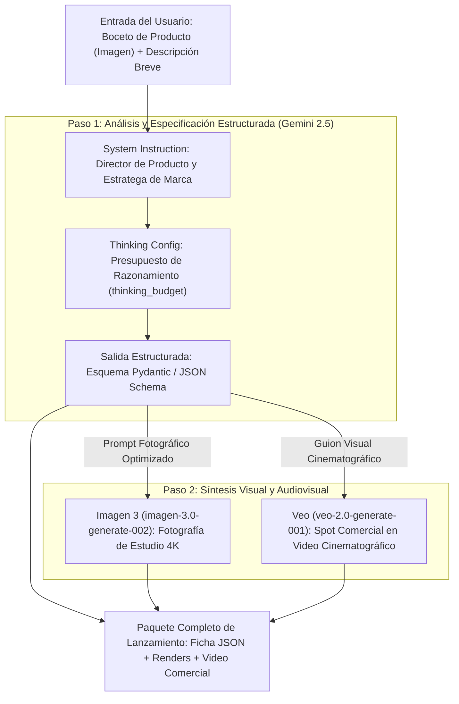

# Módulo 2: Fundamentos, Prompts, Instrucciones del Sistema, Generación Multimedia y Modelos de Lenguaje

> **Objetivo del Módulo**: Dominar la selección de modelos (`gemini-2.5-flash` vs. `gemini-2.5-pro`), controlar los **presupuestos de razonamiento (`thinking_config`)**, diseñar **Instrucciones del Sistema (`system_instruction`)** deterministas, garantizar **Salidas Estructuradas** validadas mediante esquemas Pydantic y JSON Schema, generar imágenes de alta resolución con **Imagen 3** (`client.models.generate_images`) y clips de video con **Veo** (`client.models.generate_videos`), construyendo la **Etapa 1 del Proyecto Hito: El Motor Creativo de AI Product Studio**.

---

## 1. Arquitectura del Motor Multimodal de Gemini 2.5 e Imagen 3 / Veo

A diferencia de los modelos de lenguaje tradicionales que procesan únicamente texto, la familia **Gemini 2.5** es nativa multimodal desde su preentrenamiento: comprende texto, imágenes, audio, video y código en un único espacio de representación. Al combinar Gemini 2.5 con los modelos generativos especializados **Imagen 3** y **Veo**, podemos construir tuberías completas de creación de productos.



---

## 2. Selección del Modelo: Gemini 2.5 Flash vs. Gemini 2.5 Pro

Elegir el modelo adecuado para cada tarea impacta directamente la **latencia**, el **costo por millón de tokens** y la **profundidad del razonamiento**:

| Característica | `gemini-2.5-flash` | `gemini-2.5-pro` |
| :--- | :--- | :--- |
| **Fortaleza Principal** | Equilibrio sobresaliente entre velocidad, costo y razonamiento híbrido. | Máxima capacidad de razonamiento complejo, matemáticas, arquitectura de software y análisis extenso. |
| **Ventana de Contexto** | Hasta 1,048,576 tokens (1M). | Hasta 1,048,576 tokens (1M) / 2M según variante. |
| **Presupuesto de Pensamiento (`thinking_budget`)** | Configurable (desde `0` para latencia ultrabaja hasta `24576` tokens). | Razonamiento profundo nativo para problemas multifacéticos. |
| **Casos de Uso Recomendados** | Chatbots en tiempo real, extracción estructurada de datos, clasificación masiva, agentes interactivos. | Diseño de sistemas, auditoría de código complejo, síntesis de contratos extensos, planificación estratégica. |

---

## 3. Control del Presupuesto de Razonamiento (`thinking_config`)

Los modelos **Gemini 2.5** introducen el concepto de **Pensamiento Híbrido (Hybrid Thinking)**. Antes de emitir el primer token visible de respuesta, el modelo puede dedicar una cadena interna de tokens de pensamiento para descomponer el problema, verificar hipótesis y evitar alucinaciones.

Con el parámetro `thinking_config=types.ThinkingConfig(thinking_budget=...)`, tienes control milimétrico sobre el equilibrio entre velocidad y profundidad:

- **`thinking_budget=0`**: Desactiva el pensamiento interno en `gemini-2.5-flash` para obtener el menor *Time-To-First-Token* (TTFT) posible. Ideal para clasificación instantánea o respuestas conversacionales simples.
- **`thinking_budget=1024` a `4096`**: Presupuesto moderado ideal para extracción estructurada de datos, generación de especificaciones de producto o consultas SQL.
- **`thinking_budget=8192` a `24576`**: Presupuesto alto para resolución de problemas lógicos, depuración de código complejo o análisis financiero.

---

## 4. Instrucciones del Sistema (`system_instruction`) y Salidas Estructuradas (JSON Schema / Pydantic)

Cuando integras un LLM dentro de un backend de producción, recibir texto libre en Markdown con frases como *"¡Claro! Aquí tienes el JSON que pediste:"* rompe los analizadores sintácticos (`JSON.parse()` / `json.loads()`).

La solución definitiva en el SDK `google-genai` combina dos piezas:
1. **`system_instruction`**: Define la identidad, tono, reglas inquebrantables y restricciones del modelo a nivel de sistema.
2. **`response_mime_type="application/json"` + `response_schema`**: Obliga al decodificador del modelo (mediante decodificación restringida por gramática / *constrained decoding*) a emitir **únicamente** un objeto JSON que cumpla al 100% con tu clase **Pydantic** (en Python) o esquema **Type** (en TypeScript).

### Ejemplo en Python: Especificación de Producto con Pydantic y `thinking_config`

```python
from typing import List
from pydantic import BaseModel, Field
from google import genai
from google.genai import types


# 1. Definir el contrato estricto de datos con Pydantic
class EspecificacionProducto(BaseModel):
    nombre_comercial: str = Field(description="Nombre atractivo y memorable del producto")
    eslogan: str = Field(description="Eslogan publicitario de máximo 10 palabras")
    publico_objetivo: List[str] = Field(description="Lista de 3 segmentos de clientes ideales")
    caracteristicas_clave: List[str] = Field(description="5 características técnicas diferenciadoras")
    prompt_imagen_estudio: str = Field(
        description="Prompt detallado en inglés para fotografiar el producto con Imagen 3 en iluminación de estudio"
    )
    prompt_video_comercial: str = Field(
        description="Prompt cinematográfico en inglés para generar un spot de 5 segundos con Veo"
    )


def generar_ficha_producto(idea_usuario: str) -> EspecificacionProducto:
    client = genai.Client()

    instruccion_sistema = (
        "Eres el Director Creativo Principal de un estudio de diseño industrial y marketing tecnológico. "
        "Transformas ideas conceptuales en especificaciones de producto rigurosas, listas para fabricación "
        "y producción audiovisual. Responde siempre respetando el esquema JSON solicitado."
    )

    response = client.models.generate_content(
        model="gemini-2.5-flash",
        contents=f"Diseña la especificación completa para la siguiente idea de producto: {idea_usuario}",
        config=types.GenerateContentConfig(
            system_instruction=instruccion_sistema,
            temperature=0.4,
            thinking_config=types.ThinkingConfig(
                thinking_budget=2048,
            ),
            response_mime_type="application/json",
            response_schema=EspecificacionProducto,
        ),
    )

    # El SDK deserializa automáticamente la respuesta validada a la instancia Pydantic
    return response.parsed


if __name__ == "__main__":
    ficha = generar_ficha_producto(
        "Auriculares inalámbricos translúcidos con traducción simultánea offline y carga solar"
    )
    print(f"Producto: {ficha.nombre_comercial}")
    print(f"Eslogan: {ficha.eslogan}")
    print(f"Prompt para Imagen 3: {ficha.prompt_imagen_estudio}")
```

### Ejemplo Equivalente en TypeScript (`@google/genai`)

```typescript
import { GoogleGenAI, Type } from '@google/genai';

const ai = new GoogleGenAI({});

async function generarFichaProductoTS(ideaUsuario: string) {
  const response = await ai.models.generateContent({
    model: 'gemini-2.5-flash',
    contents: `Diseña la especificación completa para: ${ideaUsuario}`,
    config: {
      systemInstruction:
        'Eres el Director Creativo Principal de un estudio de diseño industrial. Responde estrictamente según el esquema JSON.',
      temperature: 0.4,
      thinkingConfig: {
        thinkingBudget: 2048,
      },
      responseMimeType: 'application/json',
      responseSchema: {
        type: Type.OBJECT,
        properties: {
          nombreComercial: { type: Type.STRING },
          eslogan: { type: Type.STRING },
          caracteristicasClave: {
            type: Type.ARRAY,
            items: { type: Type.STRING },
          },
          promptImagenEstudio: { type: Type.STRING },
          promptVideoComercial: { type: Type.STRING },
        },
        required: [
          'nombreComercial',
          'eslogan',
          'caracteristicasClave',
          'promptImagenEstudio',
          'promptVideoComercial',
        ],
      },
    },
  });

  const ficha = JSON.parse(response.text!);
  console.log('Ficha estructurada generada:', ficha);
  return ficha;
}

generarFichaProductoTS('Cafetera espresso portátil de titanio para campistas');
```

---

## 5. Generación Multimedia: Imagen 3 (`generate_images`) y Veo (`generate_videos`)

Una vez que Gemini 2.5 ha sintetizado los prompts visuales óptimos en nuestra ficha estructurada, invocamos los modelos de medios generativos a través del **mismo cliente `genai.Client()`**:

### A. Generación de Fotografía de Producto con Imagen 3

```python
from io import BytesIO
from PIL import Image
from google import genai
from google.genai import types


def generar_foto_producto(prompt_visual: str, archivo_salida: str = "producto_render.png") -> str:
    client = genai.Client()

    result = client.models.generate_images(
        model="imagen-3.0-generate-002",
        prompt=prompt_visual,
        config=types.GenerateImagesConfig(
            number_of_images=1,
            output_mime_type="image/png",
            aspect_ratio="16:9",
            person_generation="DONT_ALLOW",
        ),
    )

    for generated_image in result.generated_images:
        image = Image.open(BytesIO(generated_image.image.image_bytes))
        image.save(archivo_salida)
        print(f"Render guardado exitosamente en: {archivo_salida}")

    return archivo_salida
```

### B. Generación de Spot Comercial en Video con Veo

La generación de video de alta definición es un proceso asíncrono (Long-Running Operation / LRO). El método `client.models.generate_videos` devuelve un objeto `operation` que consultamos periódicamente hasta su finalización:

```python
import time
from google import genai
from google.genai import types


def generar_spot_video_veo(prompt_video: str, archivo_video: str = "spot_comercial.mp4") -> str:
    client = genai.Client()

    operation = client.models.generate_videos(
        model="veo-2.0-generate-001",
        prompt=prompt_video,
        config=types.GenerateVideosConfig(
            aspect_ratio="16:9",
            person_generation="dont_allow",
        ),
    )

    print("Generando video cinematográfico con Veo...")
    while not operation.done:
        time.sleep(10)
        operation = client.operations.get(operation)
        print("Procesando fotogramas...")

    video_generado = operation.response.generated_videos[0]
    client.files.download(file=video_generado.video)
    video_generado.video.save(archivo_video)
    print(f"Video comercial guardado en: {archivo_video}")
    return archivo_video
```

---

## 6. Etapa 1 del Proyecto Hito: Pipeline Completo de *AI Product Studio*

Unimos las tres capacidades (razonamiento estructurado + Imagen 3 + Veo) en el módulo central de nuestro proyecto hito:

```python
def ejecutar_pipeline_product_studio(idea_producto: str) -> dict:
    """Pipeline de la Etapa 1 del Proyecto Hito: De idea a kit multimedia completo."""
    print(f"1. Analizando y estructurando idea: '{idea_producto}'...")
    ficha = generar_ficha_producto(idea_producto)

    print(f"2. Generando fotografía de estudio con Imagen 3 para '{ficha.nombre_comercial}'...")
    ruta_imagen = generar_foto_producto(ficha.prompt_imagen_estudio, "render_oficial.png")

    print(f"3. Generando spot publicitario con Veo para '{ficha.nombre_comercial}'...")
    ruta_video = generar_spot_video_veo(ficha.prompt_video_comercial, "spot_oficial.mp4")

    return {
        "especificacion": ficha.model_dump(),
        "imagen_path": ruta_imagen,
        "video_path": ruta_video,
    }
```

---

## Cuestionario de Autoevaluación del Módulo 2

1. **¿Qué ocurre cuando configuras `thinking_budget=0` en `gemini-2.5-flash` y cuándo conviene usarlo?**
   <details>
   <summary>Ver respuesta correcta</summary>
   Desactivas la fase de razonamiento interno previo a la respuesta, minimizando el tiempo hasta el primer token (TTFT) y el consumo de tokens de pensamiento. Conviene usarlo en tareas de clasificación simple, enrutamiento rápido o respuestas conversacionales donde la latencia mínima es prioritaria.
   </details>

2. **¿Por qué es superior usar `response_schema=EspecificacionProducto` junto con `response_mime_type="application/json"` en lugar de pedir en el prompt *"Devuélveme un JSON"*?**
   <details>
   <summary>Ver respuesta correcta</summary>
   Porque <code>response_schema</code> aplica decodificación restringida por gramática (constrained decoding) en el motor de inferencia, garantizando matemáticamente que la salida cumplirá al 100% con los nombres de campos, tipos de datos y obligatoriedad definidos en el modelo Pydantic, sin texto extra ni bloques Markdown rotos.
   </details>

3. **¿Cómo se gestiona la naturaleza asíncrona de la generación de video con Veo (`client.models.generate_videos`)?**
   <details>
   <summary>Ver respuesta correcta</summary>
   La llamada inicial devuelve una operación de larga duración (Long-Running Operation). Se debe hacer sondeo (polling) mediante un bucle <code>while not operation.done:</code> llamando a <code>client.operations.get(operation)</code> cada pocos segundos hasta que <code>operation.done</code> sea <code>True</code>.
   </details>

---

## Referencias Públicas Verificadas y Documentación Oficial

- [Modelos Gemini — Guía Oficial de Variantes y Capacidades](https://ai.google.dev/gemini-api/docs/models)
- [Razonamiento y Presupuesto de Pensamiento (Gemini Thinking)](https://ai.google.dev/gemini-api/docs/thinking)
- [Salidas Estructuradas (Structured Outputs con JSON Schema y Pydantic)](https://ai.google.dev/gemini-api/docs/structured-output)
- [Generación de Imágenes con Imagen 3 en la API de Gemini](https://ai.google.dev/gemini-api/docs/imagen)
- [Generación de Video con Veo en la API de Gemini](https://ai.google.dev/gemini-api/docs/video)
