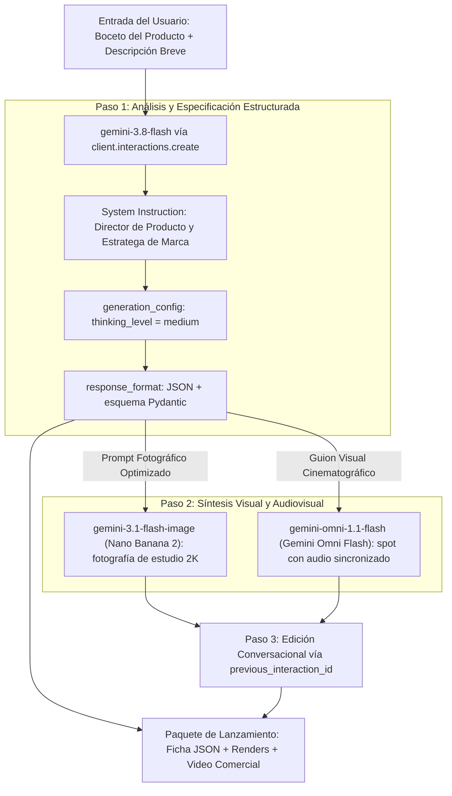

# Módulo 2: Fundamentos, Prompts, Instrucciones del Sistema, Generación Multimedia y Modelos de Lenguaje

> **Objetivo del Módulo**: Dominar la selección de modelos (`gemini-3.8-flash` vs. `gemini-3.1-pro-preview`), controlar el **nivel de razonamiento (`thinking_level`)**, diseñar **Instrucciones del Sistema (`system_instruction`)** deterministas, garantizar **Salidas Estructuradas** validadas con Pydantic y JSON Schema, generar y editar imágenes con **Nano Banana** (`gemini-3.1-flash-image`) y clips de video con audio sincronizado con **Gemini Omni Flash** (`gemini-omni-1.1-flash`), todo a través de la **Interactions API**, construyendo la **Etapa 1 del Proyecto Hito: El Motor Creativo de AI Product Studio**.

---

## 1. Tabla de Modelos Vigentes (2026)

Antes de escribir una sola línea de código, memoriza esta tabla. Es la que usaremos en todo el módulo.

| Para qué lo usas | Modelo | Nombre comercial | Notas |
| :--- | :--- | :--- | :--- |
| Texto, razonamiento y agentes (por defecto) | `gemini-3.8-flash` | Gemini 3.8 Flash | Estable. Tu caballo de batalla. |
| Razonamiento de frontera | `gemini-3.1-pro-preview` | Gemini 3.1 Pro | Vista previa. Código complejo y síntesis arquitectónica. |
| Alto volumen, bajo costo | `gemini-3.5-flash-lite` | Gemini 3.5 Flash Lite | Clasificación y enrutamiento baratos. |
| Imágenes (por defecto) | `gemini-3.1-flash-image` | **Nano Banana 2** | Estable. Generalista a escala de producción. |
| Imágenes de máxima calidad | `gemini-3-pro-image` | **Nano Banana Pro** | Estable. Renders hero, texto nítido, hasta 4K. |
| Imágenes de latencia mínima | `gemini-3.1-flash-lite-image` | **Nano Banana 2 Lite** | Estable. Volumen alto, respuesta inmediata. |
| Video con audio sincronizado | `gemini-omni-1.1-flash` | **Gemini Omni Flash** | Generación y edición conversacional de video. |

### Migración: Legado → Actual

> [!IMPORTANT]
> Muchos tutoriales publicados entre 2024 y 2025 siguen mostrando la columna izquierda. Si te topas con ellos, traduce mentalmente usando esta tabla y sigue adelante.

| Legado (no lo uses) | Actual (úsalo siempre) |
| :--- | :--- |
| `imagen-3.0-generate-002`, `client.models.generate_images()` | `gemini-3.1-flash-image` con `client.interactions.create(... response_format={"type": "image"})` |
| `veo-3.1-generate-preview`, `client.models.generate_videos()` | `gemini-omni-1.1-flash` con `client.interactions.create(... response_format={"type": "video"})` |
| Sondeo de operaciones (`while not operation.done`) para video | La interacción devuelve el video directamente en `interaction.output_video.data` |
| `gemini-2.5-flash` / `gemini-2.5-pro` | `gemini-3.8-flash` / `gemini-3.1-pro-preview` |
| `thinking_config=types.ThinkingConfig(thinking_budget=2048)` | `generation_config={"thinking_level": "medium"}` |
| `response_mime_type` + `response_schema` en `GenerateContentConfig` | `response_format={"type": "text", "mime_type": "application/json", "schema": MiModelo.model_json_schema()}` |

---

## 2. Arquitectura del Motor Multimodal

La familia **Gemini 3** es nativa multimodal desde su preentrenamiento: comprende texto, imágenes, audio, video y código en un único espacio de representación. Al combinarla con **Nano Banana** (imágenes) y **Gemini Omni Flash** (video), puedes construir tuberías completas de creación de producto sin salir del SDK.



---

## 3. Selección del Modelo de Texto: `gemini-3.8-flash` vs. `gemini-3.1-pro-preview`

Elegir el modelo adecuado para cada tarea impacta directamente la **latencia**, el **costo por millón de tokens** y la **profundidad del razonamiento**:

| Característica | `gemini-3.8-flash` | `gemini-3.1-pro-preview` |
| :--- | :--- | :--- |
| **Estado** | Estable. Modelo por defecto del curso. | Vista previa. |
| **Fortaleza Principal** | Equilibrio entre velocidad, costo y razonamiento. | Máxima capacidad de razonamiento: matemáticas, arquitectura de software y análisis extenso. |
| **Control de Razonamiento** | `thinking_level`: `low`, `medium`, `high`. | `thinking_level`: `low`, `medium`, `high`. |
| **Casos de Uso Recomendados** | Chatbots, extracción estructurada, clasificación masiva, agentes interactivos. | Diseño de sistemas, auditoría de código complejo, síntesis de contratos extensos, planificación estratégica. |

Si necesitas un tercer escalón aún más barato para clasificar o enrutar millones de peticiones, usa `gemini-3.5-flash-lite`.

---

## 4. Control del Razonamiento con `thinking_level`

Antes de emitir el primer token visible, los modelos Gemini 3 pueden dedicar una cadena interna de razonamiento para descomponer el problema, verificar hipótesis y reducir alucinaciones.

> [!WARNING]
> Gemini 3 **sustituyó el presupuesto numérico `thinking_budget` por el parámetro cualitativo `thinking_level`**. Si un ejemplo te pide un número de tokens de pensamiento, es código de la generación anterior.

Se configura dentro de `generation_config` y acepta tres valores:

- **`"low"`**: minimiza el *Time-To-First-Token*. Ideal para clasificación instantánea, enrutamiento o respuestas conversacionales simples.
- **`"medium"`**: equilibrio recomendado para extracción estructurada, generación de especificaciones de producto o consultas SQL.
- **`"high"`**: razonamiento profundo para problemas lógicos multifacéticos, depuración de código o análisis financiero.

```python
from google import genai

client = genai.Client()

interaction = client.interactions.create(
    model="gemini-3.8-flash",
    input="Dame una lista de 3 físicos famosos y su contribución clave.",
    generation_config={"thinking_level": "low"},
)
print(interaction.output_text)
```

---

## 5. Instrucciones del Sistema y Salidas Estructuradas (JSON Schema / Pydantic)

Cuando integras un modelo dentro de un backend de producción, recibir texto libre con frases como *"¡Claro! Aquí tienes el JSON que pediste:"* rompe los analizadores sintácticos (`json.loads()` / `JSON.parse()`).

La solución en el SDK `google-genai` combina dos piezas:

1. **`system_instruction`**: define identidad, tono, reglas inquebrantables y restricciones del modelo.
2. **`response_format`**: obliga al decodificador (mediante decodificación restringida por gramática / *constrained decoding*) a emitir **únicamente** un objeto JSON que cumpla tu esquema. La respuesta llega como texto en `interaction.output_text`, lista para validar con Pydantic.

### Ejemplo en Python: Especificación de Producto con Pydantic

```python
from typing import List

from pydantic import BaseModel, Field
from google import genai


# 1. Definir el contrato estricto de datos con Pydantic
class EspecificacionProducto(BaseModel):
    nombre_comercial: str = Field(description="Nombre atractivo y memorable del producto")
    eslogan: str = Field(description="Eslogan publicitario de máximo 10 palabras")
    publico_objetivo: List[str] = Field(description="Lista de 3 segmentos de clientes ideales")
    caracteristicas_clave: List[str] = Field(description="5 características técnicas diferenciadoras")
    prompt_foto_estudio: str = Field(
        description="Prompt detallado en inglés para fotografiar el producto con Nano Banana en iluminación de estudio"
    )
    prompt_video_comercial: str = Field(
        description="Prompt cinematográfico en inglés para generar un spot de 5 segundos con Gemini Omni Flash"
    )


def generar_ficha_producto(idea_usuario: str) -> EspecificacionProducto:
    client = genai.Client()

    instruccion_sistema = (
        "Eres el Director Creativo Principal de un estudio de diseño industrial y marketing tecnológico. "
        "Transformas ideas conceptuales en especificaciones de producto rigurosas, listas para fabricación "
        "y producción audiovisual. Responde siempre respetando el esquema JSON solicitado."
    )

    interaction = client.interactions.create(
        model="gemini-3.8-flash",
        input=f"Diseña la especificación completa para la siguiente idea de producto: {idea_usuario}",
        system_instruction=instruccion_sistema,
        generation_config={
            "temperature": 0.4,
            "thinking_level": "medium",
        },
        response_format={
            "type": "text",
            "mime_type": "application/json",
            "schema": EspecificacionProducto.model_json_schema(),
        },
    )

    # La salida llega en output_text y la validamos contra el modelo Pydantic
    return EspecificacionProducto.model_validate_json(interaction.output_text)


if __name__ == "__main__":
    ficha = generar_ficha_producto(
        "Auriculares inalámbricos translúcidos con traducción simultánea offline y carga solar"
    )
    print(f"Producto: {ficha.nombre_comercial}")
    print(f"Eslogan: {ficha.eslogan}")
    print(f"Prompt para Nano Banana: {ficha.prompt_foto_estudio}")
```

### Ejemplo Equivalente en TypeScript (`@google/genai`)

```typescript
import { GoogleGenAI } from '@google/genai';

const ai = new GoogleGenAI({});

const esquemaFicha = {
  type: 'object',
  properties: {
    nombreComercial: { type: 'string' },
    eslogan: { type: 'string' },
    caracteristicasClave: { type: 'array', items: { type: 'string' } },
    promptFotoEstudio: { type: 'string' },
    promptVideoComercial: { type: 'string' },
  },
  required: [
    'nombreComercial',
    'eslogan',
    'caracteristicasClave',
    'promptFotoEstudio',
    'promptVideoComercial',
  ],
};

async function generarFichaProductoTS(ideaUsuario: string) {
  const interaction = await ai.interactions.create({
    model: 'gemini-3.8-flash',
    input: `Diseña la especificación completa para: ${ideaUsuario}`,
    system_instruction:
      'Eres el Director Creativo Principal de un estudio de diseño industrial. Responde estrictamente según el esquema JSON.',
    generation_config: { temperature: 0.4, thinking_level: 'medium' },
    response_format: {
      type: 'text',
      mime_type: 'application/json',
      schema: esquemaFicha,
    },
  });

  const ficha = JSON.parse(interaction.output_text);
  console.log('Ficha estructurada generada:', ficha);
  return ficha;
}

generarFichaProductoTS('Cafetera espresso portátil de titanio para campistas');
```

---

## 6. Generación de Imágenes con Nano Banana

Una vez que `gemini-3.8-flash` ha sintetizado el prompt visual óptimo, generamos la fotografía con **Nano Banana** a través del **mismo cliente** `genai.Client()`.

La imagen llega codificada en base64 dentro de `interaction.output_image.data`, así que sólo hay que decodificarla y escribirla a disco.

### A. Fotografía de Producto (Python)

```python
import base64

from google import genai

client = genai.Client()


def generar_foto_producto(prompt_visual: str, archivo_salida: str = "producto_render.png") -> str:
    interaction = client.interactions.create(
        # gemini-3.1-flash-image = Nano Banana 2 (por defecto)
        # gemini-3-pro-image    = Nano Banana Pro (máxima calidad y texto nítido)
        model="gemini-3.1-flash-image",
        input=prompt_visual,
        response_format={
            "type": "image",
            "mime_type": "image/png",
            "aspect_ratio": "16:9",   # 1:1, 2:3, 3:4, 4:3, 4:5, 5:4, 9:16, 16:9, 21:9
            "image_size": "2K",
        },
    )

    with open(archivo_salida, "wb") as f:
        f.write(base64.b64decode(interaction.output_image.data))

    print(f"Render guardado en: {archivo_salida}")
    return interaction.id
```

Fíjate en que la función devuelve `interaction.id`: lo necesitamos para el siguiente paso.

### B. Edición Conversacional de Imágenes

Esta es la capacidad que cambia el flujo de trabajo. En lugar de reescribir el prompt completo desde cero cada vez que quieres un ajuste, encadenas la nueva instrucción a la interacción anterior con `previous_interaction_id`. El modelo conserva la composición, la iluminación y la identidad del producto, y aplica sólo el cambio pedido.

```python
def editar_render(interaction_id_previa: str, instruccion: str, archivo_salida: str) -> str:
    """Aplica un ajuste sobre un render existente conservando su composición."""
    interaction = client.interactions.create(
        model="gemini-3.1-flash-image",
        input=instruccion,
        previous_interaction_id=interaction_id_previa,
        response_format={
            "type": "image",
            "mime_type": "image/png",
            "aspect_ratio": "16:9",
            "image_size": "2K",
        },
    )

    with open(archivo_salida, "wb") as f:
        f.write(base64.b64decode(interaction.output_image.data))

    return interaction.id


# Iteración natural, turno a turno, como hablando con un fotógrafo
id_v1 = generar_foto_producto("Translucent wireless earbuds on brushed concrete, studio softbox lighting")
id_v2 = editar_render(id_v1, "Cambia el fondo a mármol blanco y sube la temperatura de color", "render_v2.png")
id_v3 = editar_render(id_v2, "Añade un reflejo sutil del producto sobre la superficie", "render_v3.png")
```

### C. La Misma Llamada en JavaScript

```javascript
import { GoogleGenAI } from '@google/genai';
import fs from 'fs';

const ai = new GoogleGenAI({});

const interaction = await ai.interactions.create({
  model: 'gemini-3.1-flash-image',
  input: 'Translucent wireless earbuds on brushed concrete, studio softbox lighting',
  response_format: {
    type: 'image',
    mime_type: 'image/png',
    aspect_ratio: '16:9',
    image_size: '2K',
  },
});

fs.writeFileSync('render.png', Buffer.from(interaction.output_image.data, 'base64'));
```

> [!NOTE]
> **Marca de agua SynthID.** Todas las imágenes generadas por Nano Banana llevan incrustada una marca de agua **SynthID**: una señal imperceptible al ojo humano que permite identificar el contenido como generado por IA aunque la imagen se recorte, comprima o se le apliquen filtros. No la elimines ni intentes ocultarla: es parte del compromiso de transparencia del modelo. Detalles en la [documentación oficial de SynthID](https://ai.google.dev/responsible/docs/safeguards/synthid).

### ¿Cuál de las tres variantes de Nano Banana elijo?

- **`gemini-3.1-flash-image` (Nano Banana 2)**: tu opción por defecto. Generalista, buena calidad y costo razonable a escala de producción.
- **`gemini-3-pro-image` (Nano Banana Pro)**: cuando necesitas el render hero de la portada, texto renderizado con precisión tipográfica dentro de la imagen o resolución 4K.
- **`gemini-3.1-flash-lite-image` (Nano Banana 2 Lite)**: cuando priorizas latencia mínima y volumen alto, por ejemplo miniaturas o previsualizaciones en tiempo real.

---

## 7. Generación de Video con Gemini Omni Flash

**Gemini Omni Flash** (`gemini-omni-1.1-flash`) genera video **con audio sincronizado nativo**: no tienes que producir la banda sonora por separado y sincronizarla después. Acepta entrada multimodal (texto, imágenes, audio y video) y devuelve el clip en base64 dentro de `interaction.output_video.data`.

### A. Spot Comercial (Python)

```python
import base64

from google import genai

client = genai.Client()


def generar_spot_video(prompt_video: str, archivo_video: str = "spot_comercial.mp4") -> str:
    interaction = client.interactions.create(
        model="gemini-omni-1.1-flash",
        input=prompt_video,
        response_format={
            "type": "video",
            "aspect_ratio": "16:9",   # admite "16:9" (por defecto) y "9:16"
        },
    )

    with open(archivo_video, "wb") as f:
        f.write(base64.b64decode(interaction.output_video.data))

    print(f"Video comercial guardado en: {archivo_video}")
    return interaction.id
```

### B. Las Cuatro Capacidades que Debes Conocer

1. **Edición conversacional de video**: encadena `previous_interaction_id` y pide el cambio en lenguaje natural. El modelo mantiene la consistencia de personajes, iluminación y estilo entre versiones.
2. **Interpolación de fotogramas clave (*keyframe interpolation*)**: entrega un fotograma inicial y uno final, y el modelo genera el movimiento intermedio coherente entre ambos.
3. **Extensión de escena (*scene extension*)**: parte de un clip existente y pide que continúe más allá de su último fotograma, conservando la continuidad visual y sonora.
4. **Audio sincronizado nativo**: diálogo, efectos y ambiente se generan alineados con la imagen en la misma pasada.

```python
# Edición conversacional: itera sobre el spot sin volver a empezar
id_spot = generar_spot_video(
    "A marble rolling fast on a chain reaction style track, continuous smooth shot."
)

interaction = client.interactions.create(
    model="gemini-omni-1.1-flash",
    input="Cambia la canica roja por una azul metalizada y alarga la escena dos segundos más.",
    previous_interaction_id=id_spot,
    response_format={"type": "video", "aspect_ratio": "16:9"},
)

with open("spot_v2.mp4", "wb") as f:
    f.write(base64.b64decode(interaction.output_video.data))
```

### C. La Misma Llamada en JavaScript

```javascript
const interaction = await ai.interactions.create({
  model: 'gemini-omni-1.1-flash',
  input: 'A marble rolling fast on a chain reaction style track, continuous smooth shot.',
  response_format: { type: 'video', aspect_ratio: '16:9' },
});

fs.writeFileSync('marble.mp4', Buffer.from(interaction.output_video.data, 'base64'));
```

---

## 8. Etapa 1 del Proyecto Hito: Pipeline Completo de *AI Product Studio*

Unimos las tres capacidades (razonamiento estructurado + Nano Banana + Gemini Omni Flash) en el módulo central de nuestro proyecto hito:

```python
def ejecutar_pipeline_product_studio(idea_producto: str) -> dict:
    """Pipeline de la Etapa 1 del Proyecto Hito: de idea a kit multimedia completo."""
    print(f"1. Analizando y estructurando idea: '{idea_producto}'...")
    ficha = generar_ficha_producto(idea_producto)

    print(f"2. Generando fotografía de estudio con Nano Banana para '{ficha.nombre_comercial}'...")
    id_render = generar_foto_producto(ficha.prompt_foto_estudio, "render_oficial.png")

    print("3. Aplicando ajuste de arte dirigido sobre el render...")
    editar_render(id_render, "Aumenta el contraste y oscurece ligeramente el fondo", "render_final.png")

    print(f"4. Generando spot con Gemini Omni Flash para '{ficha.nombre_comercial}'...")
    generar_spot_video(ficha.prompt_video_comercial, "spot_oficial.mp4")

    return {
        "especificacion": ficha.model_dump(),
        "imagen_path": "render_final.png",
        "video_path": "spot_oficial.mp4",
    }
```

---

## Cuestionario de Autoevaluación del Módulo 2

1. **¿Qué parámetro sustituyó al antiguo presupuesto numérico de razonamiento en Gemini 3, y qué valores acepta?**
   <details>
   <summary>Ver respuesta correcta</summary>
   Lo sustituyó <code>thinking_level</code>, que se pasa dentro de <code>generation_config</code> y acepta tres valores cualitativos: <code>"low"</code>, <code>"medium"</code> y <code>"high"</code>. Usa <code>"low"</code> cuando la latencia es prioritaria y <code>"high"</code> para problemas lógicos complejos.
   </details>

2. **¿Por qué es superior definir un `response_format` con `mime_type: "application/json"` y un `schema`, en lugar de pedir en el prompt *"Devuélveme un JSON"*?**
   <details>
   <summary>Ver respuesta correcta</summary>
   Porque el esquema activa decodificación restringida por gramática (<i>constrained decoding</i>) en el motor de inferencia, lo que garantiza que la salida cumpla con los nombres de campos, tipos y obligatoriedad definidos, sin texto extra ni bloques Markdown rotos. La respuesta llega en <code>interaction.output_text</code> y puedes validarla directamente con <code>MiModelo.model_validate_json(...)</code>.
   </details>

3. **¿Cómo editas una imagen ya generada sin volver a describir toda la escena desde cero?**
   <details>
   <summary>Ver respuesta correcta</summary>
   Creando una nueva interacción con <code>previous_interaction_id</code> apuntando al id de la interacción anterior y un <code>input</code> que describa únicamente el cambio deseado (por ejemplo, <i>"cambia el fondo a mármol blanco"</i>). El modelo conserva composición, iluminación e identidad del producto y aplica sólo el ajuste. El mismo mecanismo funciona para editar video con <code>gemini-omni-1.1-flash</code>.
   </details>

4. **¿Cómo obtienes los bytes del video generado por Gemini Omni Flash?**
   <details>
   <summary>Ver respuesta correcta</summary>
   El clip llega codificado en base64 en <code>interaction.output_video.data</code>. Sólo hay que decodificarlo y escribirlo a disco: <code>f.write(base64.b64decode(interaction.output_video.data))</code>. No hace falta sondear ninguna operación de larga duración.
   </details>

5. **¿Qué es SynthID y por qué importa en un flujo de trabajo de producto?**
   <details>
   <summary>Ver respuesta correcta</summary>
   SynthID es una marca de agua imperceptible que Google incrusta en todas las imágenes generadas por sus modelos, y que sobrevive a recortes, compresión y filtros. Permite verificar que un activo visual fue generado por IA, lo cual es relevante para cumplimiento, atribución y transparencia frente a clientes y reguladores.
   </details>

6. **Tienes que generar 50.000 miniaturas de catálogo con latencia mínima. ¿Qué variante de Nano Banana eliges y por qué?**
   <details>
   <summary>Ver respuesta correcta</summary>
   <code>gemini-3.1-flash-lite-image</code> (Nano Banana 2 Lite), que está optimizado precisamente para latencia ultrabaja y volumen alto. Reserva <code>gemini-3-pro-image</code> (Nano Banana Pro) para los renders hero donde necesitas 4K o texto tipográfico preciso dentro de la imagen.
   </details>

---

## Referencias Públicas Verificadas y Documentación Oficial

- [Catálogo Oficial de Modelos de la API de Gemini](https://ai.google.dev/gemini-api/docs/models)
- [Interactions API — Visión General](https://ai.google.dev/gemini-api/docs/interactions-overview)
- [Guía de Migración a la Interactions API](https://ai.google.dev/gemini-api/docs/migrate-to-interactions)
- [Razonamiento y `thinking_level`](https://ai.google.dev/gemini-api/docs/thinking)
- [Salidas Estructuradas (JSON Schema y Pydantic)](https://ai.google.dev/gemini-api/docs/structured-output)
- [Generación de Imágenes con Nano Banana](https://ai.google.dev/gemini-api/docs/image-generation)
- [Generación de Video con Gemini Omni Flash](https://ai.google.dev/gemini-api/docs/omni)
- [Marca de Agua SynthID](https://ai.google.dev/responsible/docs/safeguards/synthid)
