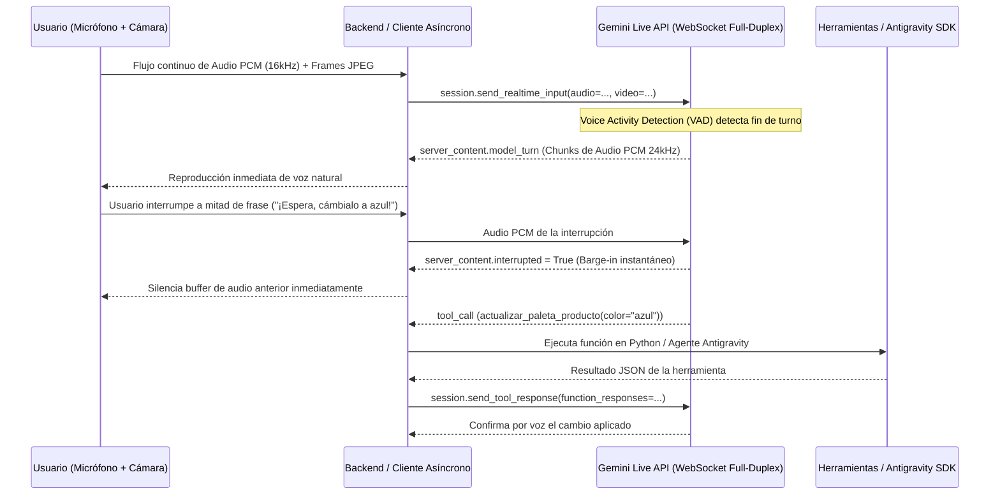

# Módulo 3: Modelos en Vivo (Live API), Agentes, Antigravity SDK y Aplicaciones

> **Objetivo del Módulo**: Construir experiencias conversacionales de latencia ultrabaja con la **Gemini Live API** (`client.aio.live.connect`) sobre WebSockets bidireccionales, procesar audio PCM y video en tiempo real, gestionar interrupciones naturales del usuario (*barge-in*) con Voice Activity Detection (VAD), dotar a los modelos de herramientas ejecutables (**Function Calling / Tool Use**), y adentrarse en el **SDK público de Google Antigravity (`antigravity.google`)** para construir la **Etapa 2 del Proyecto Hito: Copiloto Multimodal en Vivo con Agentes Autónomos**.

---

## 1. Arquitectura de Streaming Bidireccional con Gemini Live API

En una arquitectura HTTP REST tradicional (`generate_content`), el cliente debe esperar a que el usuario termine de hablar, transcribir el audio a texto (STT), enviar el texto al LLM y luego convertir la respuesta a voz (TTS). Esto introduce latencias de 2 a 5 segundos y destruye la fluidez conversacional.

La **Gemini Live API** elimina todos los intermediarios: establece una **sesión WebSocket persistente y full-duplex** directamente contra el modelo multimodal nativo.



---

## 2. Conceptos Clave de la Gemini Live API

1. **Formato de Audio PCM Nativo**:
   - **Entrada (Cliente -> Gemini)**: Audio PCM crudo de 16 bits, little-endian, mono, a **16,000 Hz** (`audio/pcm;rate=16000`).
   - **Salida (Gemini -> Cliente)**: Audio PCM crudo de 16 bits, little-endian, mono, a **24,000 Hz** (`audio/pcm;rate=24000`).
2. **Detección de Actividad de Voz (VAD) e Interrupciones (*Barge-in*)**:
   - El servidor analiza continuamente el flujo de audio entrante. Si el usuario comienza a hablar mientras el modelo está respondiendo, el servidor aborta la generación en curso y emite un evento con la bandera `server_content.interrupted = True`. Tu aplicación solo debe vaciar la cola de reproducción de audio local para lograr una conversación tan natural como una llamada telefónica humana.
3. **Visión Continua en Tiempo Real**:
   - Puedes enviar fotogramas JPEG codificados capturados desde la cámara web o la pantalla del ordenador a 1 FPS junto con el audio, permitiendo al modelo "ver" el prototipo o el código del que le estás hablando.

---

## 3. Tool Calling / Function Calling: Conectando Gemini con el Mundo Exterior

Un modelo de lenguaje aislado solo puede generar texto o audio. El **Function Calling (Llamada a Herramientas)** transforma a Gemini en un **agente capaz de actuar**: consultar bases de datos, modificar el estado de una aplicación, invocar APIs externas o disparar flujos de trabajo.

En el SDK `google-genai`, puedes pasar funciones de Python directamente en la lista `tools=[...]`. El SDK inspecciona automáticamente la firma de tipos (`type hints`) y el *docstring* de la función para construir la declaración JSON Schema para el modelo.

### Implementación Completa en Python: Sesión Asíncrona con Live API y Tool Calling

```python
import asyncio
from google import genai
from google.genai import types


# 1. Definir herramientas ejecutables con tipado estricto y docstrings claros
def actualizar_diseno_producto(
    nombre_producto: str,
    color_primario: str,
    material: str,
) -> dict:
    """Actualiza en tiempo real los parámetros de diseño industrial del producto activo.

    Args:
        nombre_producto: Nombre del producto que se está editando.
        color_primario: Nuevo color hexadecimal o descriptivo solicitado por el usuario.
        material: Material de fabricación (ej. aluminio anodizado, titanio, policarbonato reciclado).
    """
    print(f"[HERRAMIENTA EJECUTADA] Actualizando {nombre_producto} -> Color: {color_primario}, Material: {material}")
    return {
        "status": "actualizado",
        "producto": nombre_producto,
        "color_aplicado": color_primario,
        "material_aplicado": material,
    }


def consultar_inventario_componentes(categoria: str) -> dict:
    """Consulta la disponibilidad y costo unitario de componentes electrónicos o materiales.

    Args:
        categoria: Categoría del componente (ej. sensores, baterias, pantallas).
    """
    catalogo = {
        "sensores": {"stock": 1450, "costo_usd": 4.25},
        "baterias": {"stock": 820, "costo_usd": 8.90},
        "pantallas": {"stock": 310, "costo_usd": 14.50},
    }
    return catalogo.get(categoria.lower(), {"stock": 0, "costo_usd": 0.0})


# Mapa de despacho para invocar la función solicitada por el modelo
MAPA_HERRAMIENTAS = {
    "actualizar_diseno_producto": actualizar_diseno_producto,
    "consultar_inventario_componentes": consultar_inventario_componentes,
}


async def iniciar_copiloto_en_vivo():
    client = genai.Client()
    modelo_live = "gemini-2.0-flash-live-001"

    configuracion_live = types.LiveConnectConfig(
        response_modalities=["AUDIO"],
        system_instruction=types.Content(
            parts=[
                types.Part.from_text(
                    text=(
                        "Eres el Copiloto Multimodal en Vivo de AI Product Studio. "
                        "Ayudas a diseñadores e ingenieros a iterar productos por voz. "
                        "Cuando el usuario pida cambiar materiales, colores o consultar stock, "
                        "invoca siempre las herramientas disponibles."
                    )
                )
            ]
        ),
        tools=[actualizar_diseno_producto, consultar_inventario_componentes],
    )

    async with client.aio.live.connect(model=modelo_live, config=configuracion_live) as session:
        print("Sesión WebSocket Live API establecida con éxito.")

        # Enviar un turno inicial de texto o audio
        await session.send_client_content(
            turns=types.Content(
                role="user",
                parts=[
                    types.Part.from_text(
                        text="Hola copiloto, cambia el material de los Auriculares Aura a titanio cepillado color grafito y revisa el stock de baterias."
                    )
                ],
            ),
            turn_complete=True,
        )

        # Bucle asíncrono de recepción de eventos del servidor
        async for response in session.receive():
            # 1. Manejar interrupciones (Barge-in)
            if response.server_content and response.server_content.interrupted:
                print("\n[BARGE-IN] El usuario interrumpió al modelo. Limpiando buffer de audio...")
                continue

            # 2. Manejar chunks de audio PCM de salida
            if response.data is not None:
                # Aquí enviarías response.data (bytes PCM 24kHz) al altavoz o WebSocket cliente
                print(".", end="", flush=True)

            # 3. Manejar llamadas a herramientas (Tool Calls)
            if response.tool_call:
                respuestas_herramientas = []
                for fc in response.tool_call.function_calls:
                    print(f"\n[MODELO SOLICITA HERRAMIENTA]: {fc.name}({fc.args})")
                    funcion_python = MAPA_HERRAMIENTAS.get(fc.name)
                    if funcion_python:
                        resultado = funcion_python(**fc.args)
                        respuestas_herramientas.append(
                            types.FunctionResponse(
                                id=fc.id,
                                name=fc.name,
                                response=resultado,
                            )
                        )

                # Devolver el resultado de la herramienta a la sesión Live
                await session.send_tool_response(function_responses=respuestas_herramientas)

            if response.server_content and response.server_content.turn_complete:
                print("\n[Turno del modelo completado]")
                break


if __name__ == "__main__":
    asyncio.run(iniciar_copiloto_en_vivo())
```

### Implementación en TypeScript con Live API (`@google/genai`)

```typescript
import { GoogleGenAI, Modality } from '@google/genai';

const ai = new GoogleGenAI({});

async function conectarCopilotoLiveTS() {
  const session = await ai.live.connect({
    model: 'gemini-2.0-flash-live-001',
    config: {
      responseModalities: [Modality.AUDIO],
      systemInstruction: 'Eres un copiloto de diseño industrial ágil y conciso.',
    },
    callbacks: {
      onopen: () => console.log('Conexión WebSocket Live abierta.'),
      onmessage: (message) => {
        if (message.serverContent?.interrupted) {
          console.log('[Barge-in] Interrupción detectada: vaciando cola de audio.');
        }
        if (message.data) {
          // Procesar bytes de audio PCM a 24kHz
          process.stdout.write('.');
        }
      },
      onerror: (e) => console.error('Error en Live API:', e),
      onclose: () => console.log('Sesión Live cerrada.'),
    },
  });

  await session.sendClientContent({
    turns: [{ role: 'user', parts: [{ text: 'Dame 3 ideas rápidas de acabados sostenibles.' }] }],
    turnComplete: true,
  });
}

conectarCopilotoLiveTS();
```

---

## 4. Inmersión Profunda: El SDK Público de Google Antigravity (`antigravity.google`)

Cuando tu aplicación crece más allá de un par de funciones aisladas y necesitas que un sistema de IA **planifique, navegue por repositorios, ejecute comandos de terminal, verifique resultados y corrija sus propios errores**, entras en el terreno de **Google Antigravity** ([https://antigravity.google](https://antigravity.google)).

### ¿Qué es Google Antigravity y su Arnés de Agentes (Agent Harness)?

Google Antigravity es el entorno y plataforma de desarrollo agentivo de Google diseñado para transformar la interacción con los modelos Gemini en **bucles autónomos de ingeniería verificable**.

Su arquitectura pública se apoya en cuatro pilares fundamentales:

1. **Arnés de Ejecución de Agentes (Agent Harness)**:
   - En lugar de una simple llamada pregunta-respuesta, el arnés de Antigravity ejecuta un ciclo iterativo de **Pensamiento -> Acción (Tool Call) -> Observación -> Verificación**.
   - El agente mantiene memoria del estado del espacio de trabajo y no da una tarea por terminada hasta que las pruebas o validaciones pasan.
2. **Protocolo de Contexto de Modelo (Model Context Protocol / MCP)**:
   - Antigravity se integra nativamente con servidores **MCP**, permitiendo exponer bases de datos, sistemas de diseño, APIs internas y herramientas de observabilidad mediante un protocolo estándar y desacoplado.
3. **Reglas de Proyecto (`.agents/rules/`) y Habilidades (`SKILL.md`)**:
   - Permite codificar el conocimiento institucional del equipo en archivos Markdown versionados en Git, que el agente carga dinámicamente según la tarea.
4. **Interoperabilidad Total con Llaves de AI Studio y Vertex AI**:
   - Puedes conectar tus llaves `GEMINI_API_KEY` de Google AI Studio o tus credenciales de Google Cloud directamente en Antigravity para potenciar tus flujos de trabajo.

---

## Conexión con el Proyecto Hito: Etapa 2 del Copiloto Multimodal en Vivo

Con el código de este módulo, nuestro **AI Product Studio** ha evolucionado de un generador bajo demanda (Etapa 1) a un **Copiloto Interactivo en Vivo (Etapa 2)**:
- El usuario puede hablarle por micrófono y mostrarle bocetos en cámara web.
- El copiloto responde por voz en milisegundos, soporta interrupciones naturales (*barge-in*) y ejecuta herramientas reales (`actualizar_diseno_producto`, `consultar_inventario_componentes`) que actualizan la base de datos y disparan nuevos renders de Imagen 3.

---

## Cuestionario de Autoevaluación del Módulo 3

1. **¿Qué frecuencias de muestreo (sample rates) de audio PCM utiliza la Gemini Live API para la entrada del micrófono y para la salida de voz del modelo?**
   <details>
   <summary>Ver respuesta correcta</summary>
   La entrada de audio enviada al modelo debe ser PCM de 16 bits mono a <b>16,000 Hz (16 kHz)</b>, mientras que el audio sintetizado devuelto por el modelo es PCM de 16 bits mono a <b>24,000 Hz (24 kHz)</b>.
   </details>

2. **¿Cómo debe reaccionar tu cliente frontend/backend cuando recibe `response.server_content.interrupted == True`?**
   <details>
   <summary>Ver respuesta correcta</summary>
   Debe detener y vaciar inmediatamente el buffer/cola de reproducción de audio del cliente para silenciar la voz del modelo al instante, permitiendo que la interrupción del usuario (<i>barge-in</i>) se sienta completamente natural.
   </details>

3. **¿Cómo infiere el SDK `google-genai` el esquema de parámetros de una herramienta cuando le pasas una función de Python en `tools=[mi_funcion]`?**
   <details>
   <summary>Ver respuesta correcta</summary>
   El SDK inspecciona por reflexión las anotaciones de tipos de Python (<i>type hints</i>) y el <i>docstring</i> (descripción general y sección <code>Args:</code>) para construir automáticamente la declaración <code>FunctionDeclaration</code> compatible con OpenAPI/JSON Schema.
   </details>

---

## Referencias Públicas Verificadas y Documentación Oficial

- [Gemini Live API — Guía Oficial de Streaming Bidireccional](https://ai.google.dev/gemini-api/docs/live)
- [Function Calling / Uso de Herramientas en Gemini API](https://ai.google.dev/gemini-api/docs/function-calling)
- [Google Antigravity — Portal Oficial y Documentación](https://antigravity.google)
- [Documentación Oficial de Google Antigravity Docs](https://antigravity.google/docs)
- [Repositorio Oficial de Ejemplos del SDK Python `google-genai`](https://github.com/googleapis/python-genai)
