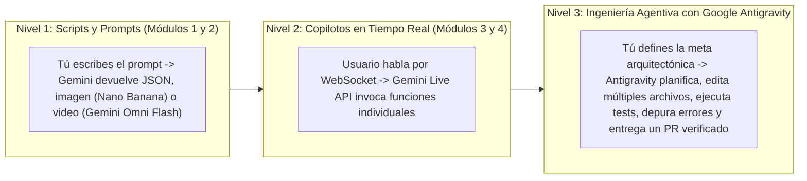

# Cierre Sorpresa (Surprise Finisher): Graduación hacia Google Antigravity (`antigravity.google`)

> **¡Felicitaciones por completar los 4 módulos troncales!** Has pasado de configurar tu primera llave de API en Google AI Studio a desplegar en producción un **Copiloto Multimodal en Vivo y Estudio Creativo de Productos** sobre Google Cloud Run con CI/CD sin llaves estáticas.
>
> Ahora llega el momento del **salto de paradigma definitivo**: pasar de escribir scripts que invocan APIs de modelos a **dirigir agentes autónomos de ingeniería de software** con **Google Antigravity** ([https://antigravity.google](https://antigravity.google)).

---

## 1. El Cambio de Paradigma: De Llamar a una API a Orquestar un Ingeniero Autónomo

Observa la evolución que has recorrido a lo largo de este curso:



Cuando trabajas directamente con la API de Gemini (`client.interactions.create`), tu código controla el flujo paso a paso. Cuando das el salto a **Google Antigravity**, delegas misiones completas de ingeniería de software a un agente equipado con:
- Acceso controlado a tu sistema de archivos y terminal.
- Comprensión semántica profunda de todo tu repositorio.
- Navegador headless integrado para verificar visualmente tu frontend en vivo.
- Integración nativa con el **Protocolo de Contexto de Modelo (MCP)** y **Habilidades reutilizables (`SKILL.md`)**.

---

## 2. Primeros Pasos en Google Antigravity (`antigravity.google`)

1. **Descarga e Instalación**:
   - Ingresa al portal oficial [https://antigravity.google](https://antigravity.google) y descarga el entorno para tu sistema operativo (macOS, Linux o Windows).
   - Consulta la documentación oficial en [https://antigravity.google/docs](https://antigravity.google/docs).
2. **Conexión con tu Ecosistema de Google AI Studio y Cloud**:
   - Abre el repositorio de tu proyecto hito (`ai-product-studio`) en Google Antigravity.
   - Puedes reutilizar tus credenciales de Google Cloud y tus llaves de API (`GEMINI_API_KEY`) que configuraste en el Módulo 1 para que tanto tu aplicación como tus agentes compartan el mismo entorno de desarrollo.

---

## 3. Anatomía de un Repositorio Agentivo: Reglas (`.agents/rules/`) y Habilidades (`SKILL.md`)

Para que un agente autónomo construya software con el mismo rigor que un ingeniero sénior de tu equipo, debes codificar las reglas de arquitectura y los procedimientos operativos directamente en el repositorio.

### A. Reglas de Arquitectura del Proyecto (`.agents/rules/arquitectura-genai.md`)

Crea el archivo `.agents/rules/arquitectura-genai.md` en la raíz de tu proyecto **AI Product Studio**. Google Antigravity leerá estas directrices automáticamente en cada tarea:

```markdown
# Reglas Inquebrantables de Arquitectura — AI Product Studio

1. **SDK Unificado Obligatorio**:
   - Utiliza EXCLUSIVAMENTE el paquete oficial `google-genai` en Python (`from google import genai`) y `@google/genai` en TypeScript.
   - NUNCA importes ni agregues a `requirements.txt` el paquete obsoleto `google-generativeai`.
2. **Superficie de API**:
   - Toda llamada nueva debe usar `client.interactions.create`. No introduzcas `client.models.generate_content` en código nuevo.
   - Encadena turnos con `previous_interaction_id`. En endpoints públicos, pasa `store=False`.
3. **Modelos Permitidos (fijados)**:
   - Texto y agentes: `gemini-3.8-flash`. Razonamiento de frontera: `gemini-3.1-pro-preview`.
   - Imágenes: `gemini-3.1-flash-image` (o `gemini-3-pro-image` para renders hero).
   - Video: `gemini-omni-1.1-flash`. Tiempo real: `gemini-3.8-live`.
   - RECHAZA cualquier cambio que introduzca `gemini-3.1-flash-image.0-*`, `veo-*`, `gemini-2.x-*` o los métodos `generate_images` / `generate_videos`.
4. **Contratos de Datos Estrictos**:
   - Toda llamada que alimente una API o base de datos DEBE incluir `response_format={"type": "text", "mime_type": "application/json", "schema": ...}` y validarse con Pydantic v2 sobre `interaction.output_text`.
   - Controla el razonamiento con `generation_config={"thinking_level": ...}`. El parámetro numérico `thinking_budget` ya no existe.
5. **Seguridad y Secretos**:
   - Jamás escribas llaves de API en código fuente. Lee siempre las credenciales desde variables de entorno inyectadas por Google Cloud Secret Manager.
   - Toda entrada de usuario debe pasar por la función de sanitización y envolverse en delimitadores XML antes de concatenarse en un prompt.
```

### B. Creación de una Habilidad Reutilizable (`.agents/skills/auditoria-seguridad-ia/SKILL.md`)

Las **Skills (`SKILL.md`)** son paquetes modulares de conocimiento experto y flujos de trabajo paso a paso que el agente activa únicamente cuando la tarea lo requiere (ahorrando ventana de contexto).

Crea `.agents/skills/auditoria-seguridad-ia/SKILL.md`:

```markdown
---
name: auditoria-seguridad-ia
description: Audita endpoints FastAPI y llamadas a Gemini API en busca de vulnerabilidades de Prompt Injection, falta de Safety Settings, ausencia de esquemas Pydantic o exposición de secretos. Úsese antes de hacer commit o desplegar a Cloud Run.
---

# Flujo de Auditoría de Seguridad para Aplicaciones Gemini

Cuando el usuario solicite auditar la seguridad del proyecto o preparar un despliegue a producción, ejecuta rigurosamente los siguientes pasos:

1. **Verificación del SDK**:
   - Busca en todo el repositorio cualquier aparición de `google.generativeai` y reemplázala por `from google import genai`.
2. **Verificación de Modelos y Superficie de API**:
   - Busca identificadores heredados (`gemini-3.1-flash-image.0-`, `veo-`, `gemini-3.8-flash-live`, `gemini-3.8-`) y los métodos `generate_images` / `generate_videos`. Sustitúyelos por `gemini-3.1-flash-image`, `gemini-omni-1.1-flash`, `gemini-3.8-live` y `gemini-3.8-flash` a través de `client.interactions.create`.
   - Busca `thinking_budget` y reemplázalo por `generation_config={"thinking_level": ...}`.
3. **Inspección de Endpoints FastAPI**:
   - Verifica que cada ruta `@app.post` limite la longitud de entrada (`max_length`) en su modelo Pydantic.
   - Confirma que los datos del usuario estén delimitados explícitamente y separados de `system_instruction`.
   - Confirma que los endpoints públicos pasen `store=False`.
4. **Verificación de Salidas Estructuradas**:
   - Comprueba que toda llamada que alimente la API declare `response_format` con su esquema y valide `interaction.output_text` con Pydantic.
5. **Verificación de Pruebas**:
   - Ejecuta `pytest` en la terminal y corrige cualquier fallo antes de reportar la auditoría como superada.
```

---

## 4. Conexión de Servidores MCP (Model Context Protocol)

El **Model Context Protocol (MCP)** permite conectar herramientas externas (como tu base de datos PostgreSQL de productos, la documentación oficial o tu servicio en Cloud Run) directamente al cerebro de Google Antigravity.

Ejemplo de configuración de un servidor MCP local en tu entorno de trabajo (`mcp_config.json`):

```json
{
  "mcpServers": {
    "catalogo-productos-db": {
      "command": "npx",
      "args": [
        "-y",
        "@modelcontextprotocol/server-postgres",
        "postgresql://localhost:5432/ai_product_studio"
      ]
    }
  }
}
```

Con esta conexión activa, puedes pedirle a Google Antigravity en lenguaje natural:
> *"Consulta el esquema real de la tabla de productos mediante MCP, crea una nueva herramienta de Function Calling para la Gemini Live API que permita filtrar productos por huella de carbono, escribe sus tests unitarios y verifica que pasen."*

---

## 5. Misión Final de Graduación: Evoluciona tu Proyecto Hito con Agentes en Paralelo

Para graduarte oficialmente de este curso, abre tu repositorio de **AI Product Studio & Copiloto Multimodal en Vivo** dentro de **Google Antigravity** y ejecuta tu primera misión de ingeniería autónoma:

1. Añade los archivos `.agents/rules/arquitectura-genai.md` y `.agents/skills/auditoria-seguridad-ia/SKILL.md` que acabamos de crear.
2. Lanza el siguiente prompt maestro al agente de Antigravity:
   > *"Activa la habilidad `@auditoria-seguridad-ia` sobre nuestro backend FastAPI, añade soporte de caché de contexto (Context Caching) en el SDK `google-genai` para el catálogo maestro de materiales, genera las pruebas unitarias con `pytest` y verifica que el contenedor Docker compile limpiamente."*
3. Observa cómo el agente planifica, edita los archivos respetando tus reglas de arquitectura, ejecuta la terminal por sí mismo y te entrega un cambio listo para desplegar a Cloud Run mediante tu pipeline de GitHub Actions.

---

## Cuestionario de Autoevaluación de Graduación

1. **¿Cuál es la diferencia fundamental entre una Regla (`.agents/rules/`) y una Habilidad (`SKILL.md`) en Google Antigravity?**
   <details>
   <summary>Ver respuesta correcta</summary>
   Las <b>Reglas (<code>.agents/rules/</code>)</b> son directrices globales e invariables del proyecto (como estándares de código, arquitectura o uso obligatorio del SDK <code>google-genai</code>) que siempre se respetan. Las <b>Habilidades (<code>SKILL.md</code>)</b> son flujos de trabajo especializados con metadatos YAML (<code>name</code> y <code>description</code>) que el agente carga bajo demanda únicamente cuando la tarea actual coincide con su propósito.
   </details>

2. **¿Qué papel juega el Protocolo de Contexto de Modelo (MCP) en un flujo de trabajo agentivo?**
   <details>
   <summary>Ver respuesta correcta</summary>
   MCP proporciona una interfaz abierta y estandarizada para conectar fuentes de contexto externas (bases de datos, APIs, herramientas de infraestructura o documentación) al agente sin necesidad de escribir integraciones ad-hoc para cada cliente o modelo.
   </details>

---

## Referencias Públicas Verificadas y Documentación Oficial

- [Google Antigravity — Sitio Oficial y Descarga](https://antigravity.google)
- [Google Antigravity — Documentación Oficial para Desarrolladores](https://antigravity.google/docs)
- [Google AI Studio — Portal de Desarrollo y API Keys](https://aistudio.google.com)
- [Documentación Oficial de la API de Gemini](https://ai.google.dev/gemini-api/docs)
- [Catálogo Oficial de Modelos de la API de Gemini](https://ai.google.dev/gemini-api/docs/models)
- [Interactions API — Visión General](https://ai.google.dev/gemini-api/docs/interactions-overview)
- [Guía de Migración a la Interactions API](https://ai.google.dev/gemini-api/docs/migrate-to-interactions)
- [SDK Unificado de Google Gen AI en GitHub (`python-genai`)](https://github.com/googleapis/python-genai)
